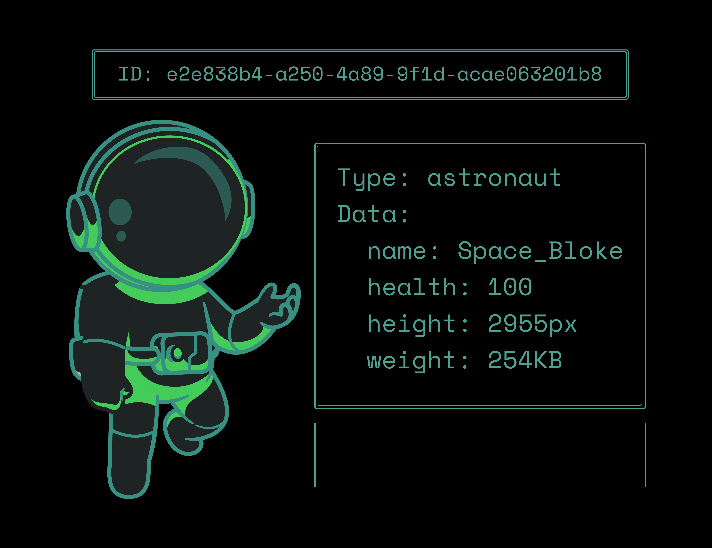
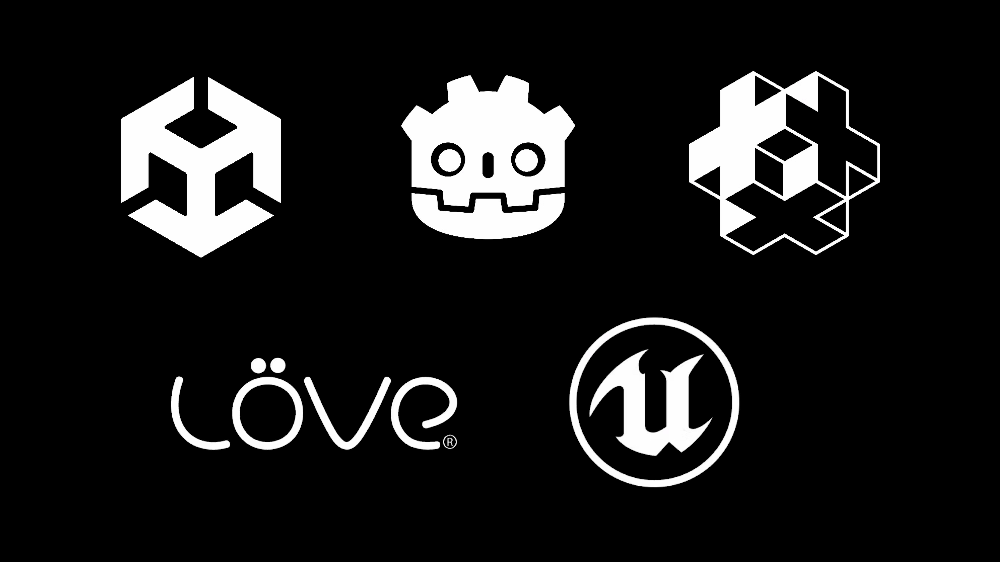

# Introduction

Planetary Processing is a toolkit to make the creation and operation of online multiplayer games extremely easy. You control the behaviour of your simulation by creating and editing scripts which run in on our servers using our comprehensive API. We then provide easy-to-use SDKs for popular game engines which handle all the networking for you.

## Entities

The core of the Planetary Processing engine is the entity, everything in your world is an entity. Each entity has a type and the type of the entity determines its behaviour. Behaviour is scripted in a repository we provide per-game, each type of entity needs its own behaviour script on the backend. Each entity has data which is visible to all players and the server.

<figure><figcaption></figcaption></figure>

## Chunks

Planetary Processing works by dividing your world into chunks, where each chunk contains the subset of entities within the world which are contained in the cuboid of this chunk. Chunks are of fixed width and depth, and of infinite height. Each chunk may be simulated separately on one of our many servers, this allows your games to scale to massive sizes, allowing player counts beyond traditional multiplayer games - it also allows us to keep costs low.

Chunks may be loaded or unloaded, if a chunk is loaded it is being actively simulated and is using computation resources. Otherwise its state is stored and it is not actively being updated.

Each time a chunk is loaded we run a special script which is defined within your game repository and is called 'init'. This initialises the state of the chunk (i.e. spawns the required entities). Subsequently the server proceeds in steps called 'ticks' where it updates all entities according to their script. We have a variable (chunk.Generated) which tells you if this chunk has been loaded before, if this variable is false you can do first time setup in the init function.

<figure><figcaption></figcaption></figure>

## Clients

You can use one of our SDKs to implement a game client in the engine of your choice. We currently support Unity, Unreal, Godot, Defold and LÖVE.

The SDK connects to our servers and automatically synchronises the state of the 3x3 grid of chunks around the connected player down to the client, meaning you don't need to do any netcode at all! Our SDKs can even spawn the entities as objects in your chosen game engine and move them around for you.

The client is able to send messages up to the backend which are received by the player's entity script.

<figure><figcaption></figcaption></figure>

## Dimensions

Planetary Processing games can have multiple separate dimensions simulated in parallel, with entities transitioning between these instances seamlessly. This is useful for several use cases, for example:

* Creating separate parallel, persistent, dimensions akin to the Nether or End in Minecraft;
* Creating separate instances for matches, dungeons or private sessions;
* Creating pocket dimensions, for example, a player's house or a dungeon.

By default, there is only one dimension with dimension ID of the empty string (`""`), but new dimensions can be created and destroyed with API calls.

<figure><figcaption></figcaption></figure>

## Lua

We use Lua for our server-side scripting, if you're new to Lua we recommend giving [this excellent guide](https://learnxinyminutes.com/lua/) a read!
