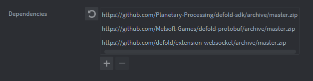

# Defold

Follow these steps to quickly set up and start using Planetary Processing with your Defold game. For more detailed information on both the SDK and the server-side API, please visit our [documentation](https://docs.planetaryprocessing.io/).

## Defold Version

We recommend using Defold's most recent release version. If you are using an older version, we recommend a minimum of 1.8.0 for a successful integration.

## Create a Planetary Processing Game

1. Navigate to the [games section of our web panel](https://panel.planetaryprocessing.io/games)
2. Click **Create Game** in the top right
3. Provide the details of your game. Upon its creation, you will be taken to your Game Dashboard.
4. For this quick start, we will be using **Anonymous Auth**, which allows players to connect without a username and password. To enable this, navigate to the settings section of your Game Dashboard and enable Anonymous Auth as the Player Authentication Type within Game Settings.


## Clone your Game Repository

1. Clone the [git](../server/git.md) repository as listed in your game dashboard - this is your Planetary Processing backend code.

```sh
git clone https://git.planetaryprocessing.io/git/aBcDE/my-planetary-processing-game.git
```

## Setting up your Defold project

Our Defold SDK can be used either as a dependency for a project or as an example project itself. You can use it as a template to get started quickly and familiarise yourself with a working project, since it matches the server-side demo code.

1. Download the zipped Defold SDK from the following url:

```sh
https://github.com/Planetary-Processing/defold-sdk/archive/master.zip
```

2. Unzip the folder to a location of your choice, then launch Defold.
3. From the Defold Editor's project selection screen, select 'Launch from Disk…'
4. Navigate to the folder, and select the `game.project` file within to open the example project.

## Connecting to your game server

Although most of the example project comes pre-built, it still needs to be directed to your personal game repository.

1. In the 'Assets' pane, expand the 'example' folder and open the `main.collection` file.
2. In the 'Outline' pane, expand the 'go' game object and select the `master - /p/master.script`.
3. In the 'Properties' pane, locate the 'Gameid' property input.
4. Enter the Game ID of your game. This is a number which can be found on your [game dashboard](https://panel.planetaryprocessing.io/games), next to your game's name and repo link.


## Test your connection

You now have everything you need to establish a basic connection between Defold and the server-side demo code.

1. On the Planetary Processing [games web panel](https://panel.planetaryprocessing.io/games), select your game to enter its dashboard.
2. Click Actions>Start Game to start the server-side simulation.
3. Launch your game from Defold.
4. In your Defold game window, press the spacebar to join the world and start moving around.

You should now be able to see the game world and all its entities. Your Planetary Processing game dashboard map should also show that a player has joined!


## The master component script

Let's have a closer look at each element of the example project, starting with the `main.collection` file.

Inside the collection there is a 'go' game object. This contains all the information needed to connect to your game server. Most of this information is stored within the component script file `master-/pp/master.script` which we used earlier to define our Game Id.

Required `master.script` properties

1. Player Url: /player
2. Game Id: 1234

As well as the Game Id, the master script also defines which game object is the main player character. In this case the 'Player Url' property is pointing to the 'player' game object within the main.collection.


## Entity generation (factories)

The 'player' game object should not be confused with the 'player' prototype, which is used for other players in the world.

A prototype is a sort of blueprint for creating game objects. Factories then reproduce these prototypes. You will notice three factories within the `main.collection`'s 'go' game object:

1. catfactory
2. playerfactory
3. Treefactory


Every entity in your world has a 'Type'. These Entity Types are defined in the backend code downloaded from your game repository.

1. Navigate back to your cloned game repository.
2. Locate the 'entity' folder.
3. Make note of the names of the .lua files inside the 'entity' folder. These are your Entity Types.


For the demo game repository, the Entity Types: cat, tree, and player are used. The factories must be prefixed by the Type of entity being generated, hence catfactory makes cat prototypes.

Required `factory` properties

1. Id: catfactory
2. Prototype: /example/cat.go


## Entities (prototypes)

Prototypes have a blue icon in the 'Assets' pane. Opening up the `cat.go` prototype, we can see that it is made up of a game object with two components. The component script `entity-/pp/entity.script` defines which prototypes are entities for your Planetary Processing game server. The 'sprite' component tells it what image to use.

Required `prototype` components

1. entity-/pp/entity.script


## The main player character

The main player character is represented by the 'player' game object in `main.collection`. It also requires an entity component script to exist in the game world. However, because there is only ever one main player character per game client, it does not have an Entity Type nor does it need a factory.

Required main player character game object components:

1. entity-/pp/entity.script
2. test-/example/player.script

In the example project, the 'player' object also has the `player.script` component file. This script is doing two things: handling the player's movement inputs and establishing the connection to the game server.


## Messaging the game server

In the example project, the 'player' object establishes the connection when the game starts up using the `init()` function. It posts a message to the game object with the `master.script` ("/go"), telling it to start a connection ("pp\_init") and providing any username/password credentials ({}).

```lua
function init(self)
	-- allow the gameobject to receive keyboard and mouse inputs
	msg.post(".", "acquire_input_focus")
    -- authorise your connection to the game server (Anonymous Auth uses an empty table as a parameter)
	msg.post("/go", "pp_init", {})
	-- save the state: that the game world has not yet been joined
	self.joined = false
end
```

But as seen earlier, we can delay the player actually joining the world until we press space, which sends another message to the master object with the hash "pp\_join".

```lua
function on_input(self, action_id, action)
    -- this shows the inputs in console
	print(action_id)
    -- join when space is pressed (and the player hasn't already joined) and update the join state
	if action_id == hash("key_space") and action.pressed and not self.joined then
		msg.post("/go", hash("pp_join"))
		self.joined = true
	end
end
```

Once authorised and joined, messages can be sent to and from the game server. The example project sends messages to the game server to handle player movement.

```lua
function on_input(self, action_id, action)
    -- initialise the player position to the world origin
	local d = {x=0, y=0, z=0}
    -- save the state: no inputs need to be sent to the game server yet
	local send = false
	-- update the position and 'send' inputs state, when the 'w' key is pressed
    -- this condition is repeated for each possible key input
	if action_id == hash("key_w") and not action.released then
		d.y = d.y + 0.5
		send = true
	end
	-- send a message to the game server containing the updated position, if a valid key press has triggered the 'send' state
	if send then
		msg.post("/go", "pp_message", d)
	end
end
```

Each time an entity on the game server moves or changes, a message is sent to its corresponding game object, with the ID hash("pp\_update"). Entities can interpret these position messages automatically, if the 'Use Server Position' property is enabled in their `entity-/pp/entity.script`. For more complex data, a custom script can be used.

```lua
function on_message(self, message_id, message, sender)
    -- print out all the key-value pairs in the message's data table sent from the game server entity's data table.
	if message_id == hash("pp_update") then
        -- the demo will print the data "hello = hello"
		for k, v in pairs(message.data) do print(k, "=", v) end
	end
end
```

## Project Settings

In the 'Assets' pane, we can see that the example project uses three libraries (with puzzle piece symbols) 'builtins', 'orthographic', and 'pb'.

1. The 'builtins' library is part of every new Defold project by default.
2. The example project uses the 'orthographic' library for ease of following the player with the orthographic camera script `camera-/orthographic/camera.script` in `main.collection`.
3. The 'pb' is the [Defold Protobuf](https://github.com/Melsoft-Games/defold-protobuf) library, which the Planetary Processing Defold SDK actively depends on.
4. The 'websocket' is the [Defold Websocket](https://github.com/defold/extension-websocket) library, which the Planetary Processing Defold SDK actively depends on.

A new Defold project would require the 'pb' and 'websocket' libraries, as well as the PP Defold SDK itself, which would act as a dependency 'pp'. Dependencies can be viewed and edited.

1. In the 'Assets' pane, open the `game.project` file.
2. Find the 'Dependencies' setting in the 'Project' tab, in the main editor window.
3. The example project has the three external dependencies:

```sh
https://github.com/Melsoft-Games/defold-protobuf/archive/master.zip
```

```sh
https://github.com/defold/extension-websocket/archive/master.zip
```

```sh
https://github.com/britzl/defold-orthographic/archive/master.zip
```

4. For a new Defold project, the Planetary Processing SDK would have to be added:

```sh
https://github.com/Planetary-Processing/defold-sdk/archive/master.zip
```



5. Whenever a new dependency is added, it must be loaded by selecting 'Fetch Libraries' from the 'Project' tab, in the topbar.


## Editing your backend code

Using the [repo](defold.md#clone-your-game-repository) we cloned earlier you can edit the behaviour of entities by changing their Lua file within the 'entity' directory.

You can also change how many and what entities are spawned in the init.lua file.

We recommend [experimenting ](../server/entities.md)here to get a sense of what you can do with Planetary Processing. When you add or change entities, make sure your server-side changes match up with your game engine client.

## Push your Planetary Processing backend code to the game repository

After configuring your game entities and logic, [push your changes](../server/git.md) to the game repository:

```sh
git add .
git commit -m "Configure game entities and logic for Planetary Processing"
git push
```

## Deploy Latest Version in the Web UI

1. Go back to your game dashboard in our web panel
2. From the actions menu in the top right, stop the game if it's running.
3. Select "Deploy Latest Version" - this will roll out your updated server-side code.

## Play and update your game

1. Start up your game again in Defold and in the web panel, to see the changes you have made!
