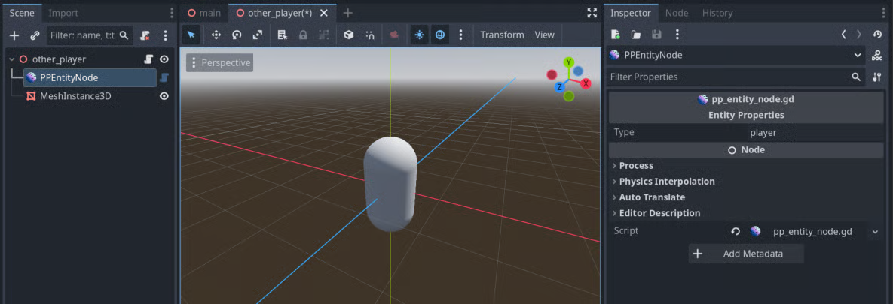

# Godot

Follow these steps to quickly set up and start using Planetary Processing with your Godot game. For more detailed information on both the [Godot SDK](../sdks/godot.md) and the [server-side API](../server/entities.md), please visit our [documentation](https://docs.planetaryprocessing.io/).

## Godot Version

We recommend using Godot's most recent release version. If you are using an older version, we recommend a minimum of v4.2.1 for a successful integration.

You will also need the most recent compatible version of the .NET SDK.

* Godot Engine v4.2.1+ **.net version required**
* .NET SDK 6.0+ (Desktop target)
* .NET SDK 7.0+ (Android target)
* .NET SDK 8.0+ (iOS target)

## Create a Planetary Processing Game

1. Navigate to the [games section of our web panel](https://panel.planetaryprocessing.io/games)
2. Click **Create Game** in the top right
3. Provide the details of your game. Upon its creation, you will be taken to your Game Dashboard.
4. For this quick start, we will be using **Anonymous Auth**, which allows players to connect without a username and password. To enable this, navigate to the settings section of your Game Dashboard and enable Anonymous Auth as the Player Authentication Type within Game Settings.

<figure><figcaption></figcaption></figure>

## Clone your Game Repository

1. Clone the [git](../server/git.md) repository as listed in your game dashboard - this is your Planetary Processing backend code.

```sh
git clone https://git.planetaryprocessing.io/git/aBcDE/my-planetary-processing-game.git
```

## Setting Up the Planetary Processing Plugin

1. Create a new Godot project, from the Project Manager.
2. In the FileSystem panel, create a new folder within the `res://` folder. Name it `addons`.
3. Right click the `addons` folder and select "Open in Terminal".
4. In the terminal, clone the Planetary Processing Godot SDK.

```sh
git clone https://github.com/planetary-processing/godot-plugin planetary_processing
```

5. In the topbar, select the ‘Project > Project Settings’.&#x20;
6. Navigate to the 'Plugins' tab and enable the Planetary Processing plugin.

<figure><figcaption></figcaption></figure>

## Setting Up the PP Root Node

1. Create a Node3D root node in the Scene panel, and save it as 'main'.
2. Add a PPRootNode as child node to your scene's root.

<figure><figcaption></figcaption></figure>

3. In the Inspector panel of the PPRootNode, enter the Game ID of your game. This is a number which can be found on your [game dashboard](https://panel.planetaryprocessing.io/games), next to your game’s name and repo link.

<figure><figcaption></figcaption></figure>

4. In the topbar, select 'Project > Tools > C# > Create C# Solution'.&#x20;
5. This creates a _.csproj_ and a _.sln_ file in the root folder of your project. (Tabbing in and out of the Godot Editor will refresh the FileSystem Panel to show the new .csproj file).

<figure><figcaption></figcaption></figure>

4. In the Inspector panel of the PPRootNode, press the "Add Csproj Reference" button. This enables Planetary Processing's C# code in your project.

We will come back to the PPRootNode after we have made some scenes to represent our player and our entities.

## Setting Up your Starting Scene

1. In the topbar, select the ‘Project > Project Settings’.&#x20;
2. In the 'General' tab, find the 'Application > Run' section.
3. Set the Main Scene to be 'main.tscn'.

<figure><figcaption></figcaption></figure>

## Creating a player character

1. Create a new scene to represent your player, and save it as 'player'.
2. Add the PPEntityNode as a direct child of the root node of your scene.
3. In the Inspector for the PPEntityNode, input `player` as the Type.
4. Add a MeshInstance to the root node of your scene.&#x20;
5. In the Inspector assign the Mesh parameter a 'New BoxMesh' to make it visible.
6. Add a Camera3D to the root node of your scene and position it to look at the player.

<figure><figcaption></figcaption></figure>

## Creating entities

Every Entity has a ‘Type’. These Entity Types are defined in the backend code downloaded from your game repository.

1. Navigate back to your [cloned game repository](godot.md#clone-your-game-repository).
2. Locate the ‘entity’ folder.
3. Make note of the names of the .lua files inside the ‘entity’ folder. These are your Entity Types.

<figure><figcaption></figcaption></figure>

For the demo game repository, the Entity Types: cat, tree, and player are used. Entities in Godot are formed from scenes containing the PPEntityNode and a valid Type parameter.&#x20;

4. Create a scene to represent one of your entities, such as a cat, and save it as 'cat'.
5. Add the PPEntityNode as a direct child of the root node of your scene.
6. In the Inspector for the PPEntityNode, input a Type. Entering ‘cat’ will sync this prefab with the ‘cat.lua’ entity in the server-side code.
7. Add a MeshInstance to the root node of your scene.&#x20;
8. In the Inspector assign the Mesh parameter a 'New SphereMesh', to make it visible.
9. Repeat the process for trees and give them a CylinderMesh.

<figure><figcaption></figcaption></figure>

## Creating other players

Other players are created in the same way as most entities, however they share their type 'player' with the player character.&#x20;

1. Create a scene to represent other players, and save it as 'other\_player'.
2. Add the PPEntityNode as a direct child of the root node of your scene.
3. In the Inspector for the PPEntityNode, input the Type 'player'.
4. Add a MeshInstance to the root node of your scene.&#x20;
5. In the Inspector assign the Mesh parameter a 'New CapsuleMesh', to make it visible.

<figure><figcaption></figcaption></figure>

## Moving entities

The PPRootNode emits a signal when entities change position or state on the server. These signals can be used to update an entity's position with new x, y, and z values.

1. Attach a new script called 'entity\_movement.gd' to the root node parameter (not PPEnityNode) of each of your entity scenes (except the player character scene), with the following code.

```gdscript
# entity_movement.gd script

# extend the functionality of your root node (here Node3D)
extends Node3D

# when the scene is loaded
func _ready():
    # connect to the state_changed signal from pp_entity_node
    var pp_entity_node= get_node_or_null("PPEntityNode")
    if pp_entity_node:
        pp_entity_node.state_changed.connect(_on_state_changed)
    else:
        print("PPEntityNode not found")

func _on_state_changed(state):
    # set the entity's position, using the server's values
    # NOTE: Planetary Processing uses 'y' for depth in 3D games, and 'z' for height. The depth axis is also inverted.
    # To convert, set Godot's 'y' to negative, then swap 'y' and 'z'.
    global_transform.origin = Vector3(state.x, state.z, -state.y) 
```

<details>

<summary>entity_movement.gd script (no comments)</summary>

```gdscript
extends Node3D

func _ready():
    var ppEntityNode = get_node_or_null("PPEntityNode")
    if pp_entity_node:
        pp_entity_node.state_changed.connect(_on_state_changed)
    else:
        print("PPEntityNode not found")

func _on_state_changed(state):
    global_transform.origin = Vector3(state.x, state.z, -state.y) 
```

</details>

<details>

<summary>entity_movement.gd script (2D)</summary>

```gdscript
extends Node2D

func _ready():
    var pp_entity_node= get_node_or_null("PPEntityNode")
    if pp_entity_node:
        pp_entity_node.state_changed.connect(_on_state_changed)
    else:
        print("PPEntityNode not found")

func _on_state_changed(state):
    global_transform.origin = Vector2(state.x, -state.y) 

```

</details>

## Configuring your server connection object <a href="#configuring-your-server-connection-object" id="configuring-your-server-connection-object"></a>

1. Return to the PPRootNode in the main scene, and start filling in its parameters.
2. Drag and drop your player.tscn into the ‘Player Scene’ input.
3. Connect cat.tscn, tree.tscn and other\_player.tscn to separate elements in the ‘Scenes’ input list.
4. You can leave Chunk Scene empty for now. Chunk scenes are optional, but for help implementing them go to [#creating-chunk-scenes](godot.md#creating-chunk-scenes "mention") below.

<figure><figcaption></figcaption></figure>

## Creating Chunk Scenes

If you wish to store data in game world chunks, you can add chunk objects to your game as scenes. These chunks will be spawned into the world as invisible nodes in their proper location, and will load and unload as the player moves around the world.&#x20;

Chunk scenes are optional and you can create a game without them if you wish.

1. Create a scene and save it as 'chunk'.
2. Add the PPChunkNode as a direct child of the root node of your scene.
3. Attach a new script called 'chunk\_update.gd' to the root node parameter (not PPChunkNode) with the following code:

```gdscript
# chunk_update.gd script

# extend the functionality of your root node (here Node3D)
extends Node3D

var pp_root_node
# when the scene is loaded
func _ready():
	# connect to the state_changed signal from pp_chunk_node
	var pp_chunk_node= get_node_or_null("PPChunkNode")
	pp_root_node = get_tree().current_scene.get_node_or_null('PPRootNode')
	if pp_chunk_node:
		pp_chunk_node.state_changed.connect(_on_state_changed)
	else:
		print("PPChunkNode not found")

func _on_state_changed(state):
	pass
	# Add code to act if chunk data changes, if necessary

```

<details>

<summary>chunk_update.gd script (no comments)</summary>

```gdscript
extends Node3D

var pp_root_node
func _ready():
	var pp_chunk_node= get_node_or_null("PPChunkNode")
	pp_root_node = get_tree().current_scene.get_node_or_null('PPRootNode')
	if pp_chunk_node:
		pp_chunk_node.state_changed.connect(_on_state_changed)
	else:
		print("PPChunkNode not found")

func _on_state_changed(state):
	pass
```

</details>

## Connecting the player

1. Attach a new script called 'root.gd' to the root node parameter (not PPRootNode) of your main scene, with the following code. This will allow the player to join and interact with the game world.

```gdscript
# root.gd script

# extend the functionality of your root node (here Node3D)
extends Node3D

# create a variable to store the PPRootNode
var pp_root_node

# when the scene is loaded
func _ready():
	pp_root_node = get_tree().current_scene.get_node_or_null("PPRootNode")
	assert(pp_root_node, "PPRootNode not found")

	pp_root_node.authenticate_player("", "")  # Start authentication
```

## Moving the player

Player inputs need to be passed to the server.

1. Select the ‘Project Settings’ from the ‘Project’ tab in the topbar.&#x20;
2. Navigate to the 'Input Map' tab and add four new actions: 'move\_forward', 'move\_left', 'move\_backward', and 'move\_right'.&#x20;
3. Use the plus symbol to add an input event to each of them.

<figure><figcaption></figcaption></figure>

3. Attach a new script called 'player.gd' to the root node parameter (not PPEntityNode) of your player scene, with the following code.

```gdscript
# player.gd script

# extend the functionality of your root node (Node3D if 3D)
extends Node3D

# create a variable to store the PPRootNode
var pp_root_node
# create a variable to handle movement speed
var speed = 5.0

# when the scene is loaded
func _ready() -> void:
    # access the PPRootNode from the scene's node tree 
    pp_root_node = get_tree().current_scene.get_node('PPRootNode')
    assert(pp_root_node, "PPRootNode not found") 
    
    # connect to the state_changed signal from pp_entity_node
    var pp_entity_node= get_node_or_null("PPEntityNode")
    if pp_entity_node:
        pp_entity_node.state_changed.connect(_on_state_changed)
    else:
        print("PPEntityNode not found")
        
func _on_state_changed(state):
    # sync the player's position, using the server's values
    # NOTE: Planetary Processing uses 'y' for depth in 3D games, and 'z' for height. The depth axis is also inverted.
    # To convert, set Godot's 'y' to negative, then swap 'y' and 'z'.
    global_transform.origin = Vector3(state.x, state.z, -state.y)

func _process(delta: float) -> void:
    # get the raw input values
    var input_direction = Vector3(
        Input.get_action_strength("move_right") - Input.get_action_strength("move_left"),
        0,
        Input.get_action_strength("move_backward") - Input.get_action_strength("move_forward") 
    )
    # calculate the input direction
    input_direction = input_direction.normalized()

    # move the player
    var movement = input_direction * speed * delta

    # on input, message the server to update the player's x and y positions
    # NOTE: Planetary Processing uses 'y' for depth in 3D games, and 'z' for height. The depth axis is also inverted.
    # To convert, set Godot's 'y' to negative, then swap 'y' and 'z'.
    if movement:
        pp_root_node.message({
            "x": movement[0],
            "y": -movement[2], 
            "z": 0,
        })
```

<details>

<summary>player.gd script (no comments)</summary>

```gdscript
extends Node3D

var pp_root_node
var speed = 5.0

func _ready() -> void: 
    pp_root_node = get_tree().current_scene.get_node('PPRootNode')
    assert(pp_root_node, "PPRootNode not found") 
    
    var pp_entity_node= get_node_or_null("PPEntityNode")
    if pp_entity_node:
        pp_entity_node.state_changed.connect(_on_state_changed)
    else:
        print("PPEntityNode not found")
        
func _on_state_changed(state):
    global_transform.origin = Vector3(state.x, state.z, -state.y)

func _process(delta: float) -> void:
    var input_direction = Vector3(
        Input.get_action_strength("move_right") - Input.get_action_strength("move_left"),
        0,
        Input.get_action_strength("move_backward") - Input.get_action_strength("move_forward") 
    )
    input_direction = input_direction.normalized()

    var movement = input_direction * speed * delta

    if movement:
        pp_root_node.message({
            "x": movement[0],
            "y": -movement[2], 
            "z": 0,
        })
```

</details>

<details>

<summary>player.gd script (2D)</summary>

```gdscript
extends Node2D

var pp_root_node
var speed = 5.0

func _ready() -> void:
    pp_root_node = get_tree().current_scene.get_node('PPRootNode')
    assert(pp_root_node, "PPRootNode not found") 
    
    var pp_entity_node= get_node_or_null("PPEntityNode")
    if pp_entity_node:
        pp_entity_node.state_changed.connect(_on_state_changed)
    else:
        print("PPEntityNode not found")
        
func _on_state_changed(state):
    global_transform.origin = Vector2(state.x, -state.y) 

func _process(delta: float) -> void:
    var input_direction = Vector2(
        Input.get_action_strength("move_right") - Input.get_action_strength("move_left"),
        Input.get_action_strength("move_backward") - Input.get_action_strength("move_forward") 
    )
    input_direction = input_direction.normalized()

    var movement = input_direction * speed * delta
    
    if movement:
        pp_root_node.message({
            "x": movement[0],
            "y": -movement[1], 
            "z": 0,
        })
```

</details>

## Test your connection

You now have everything you need to establish a basic connection between Godot and the server-side demo code.

1. On the Planetary Processing [games web panel](https://panel.planetaryprocessing.io/games), select your game to enter its dashboard.
2. Click 'Actions>Start Game' to start the server-side simulation.
3. Launch your game from Godot.

As your project runs, you should now be able to see the game world and all its entities. Your Planetary Processing game dashboard map should also show that a player has joined!

<figure><figcaption></figcaption></figure>

## Editing your backend code

[Using the repo we cloned earlier](godot.md#clone-your-game-repository) you can edit the behaviour of entities by changing their Lua file within the ‘entity’ directory.

You can also change how many and what entities are spawned in the init.lua file.

We recommend [experimenting ](../server/entities.md)here to get a sense of what you can do with Planetary Processing. When you add or change entities, make sure your server-side changes match up with your game engine client.

## Push your Planetary Processing backend code to the game repository

After configuring your game entities and logic, [push your changes](../server/git.md) to the game repository:

```sh
git add .
git commit -m "Configure game entities and logic for Planetary Processing"
git push
```

## Deploy Latest Version in the Web UI

1. Go back to your game dashboard in our web panel
2. From the actions menu in the top right, stop the game if it's running.
3. Select "Deploy Latest Version" - this will roll out your updated server-side code.

## Play and update your game

1. Start up your game again in Godot and in the web panel, to see the changes you have made!
2. If you want to learn more about updating your server-side code, check out our server-side tutorial video:\
   [https://www.youtube.com/watch?v=QYWtedo1kr4\&list=PLW5OY4K85Qhn7lwZeSPVZXH\_Lg5IwhjNC](https://www.youtube.com/watch?v=QYWtedo1kr4\&list=PLW5OY4K85Qhn7lwZeSPVZXH_Lg5IwhjNC)


## Troubleshooting

If you have encountered any issues, we have a premade demo of this guide:\
[https://drive.google.com/drive/folders/1A6pF8YSL0M1Ubb41ytmE-NEp4uHwimYX?usp=drive\_link](https://drive.google.com/drive/folders/1A6pF8YSL0M1Ubb41ytmE-NEp4uHwimYX?usp=drive_link)\
\
If you have further questions, please get in touch on our [Discord](https://pp.vg/discord).
