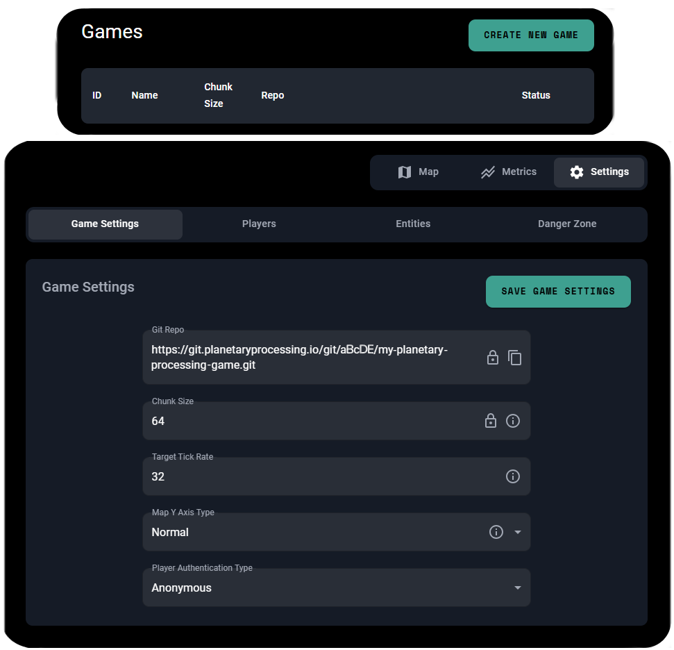
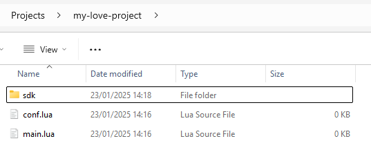
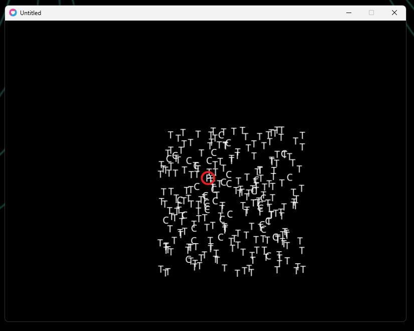
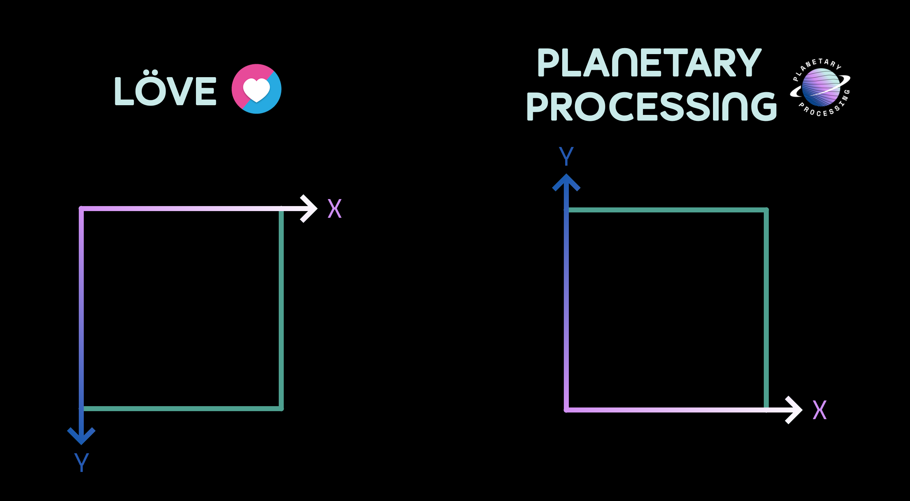
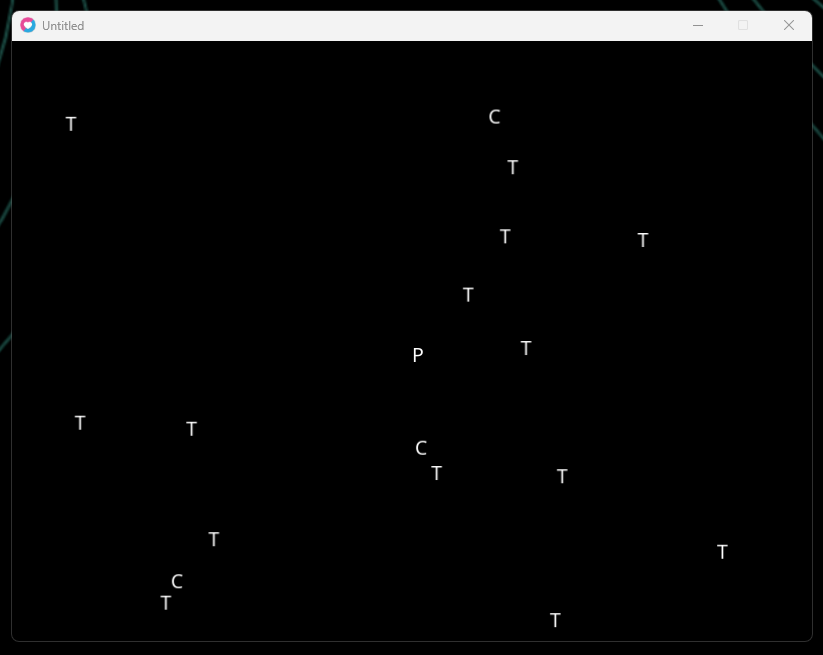
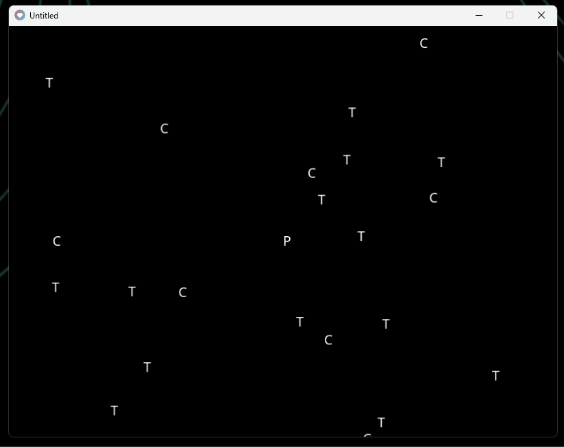
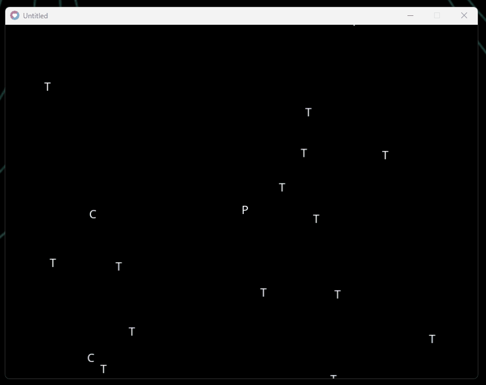

# LÖVE

Follow these steps to quickly set up and start using Planetary Processing with your LÖVE game. For more detailed information on both the [SDK](../sdks/love.md) and the [server-side API](../server/entities.md), please visit our [documentation](https://docs.planetaryprocessing.io/).

## LÖVE Version

We recommend using LÖVE's most recent release version. If you are using an older version, we recommend a minimum of 11.0 for a successful integration.

## Create a Planetary Processing Game

1. Navigate to the [games section of our web panel](https://panel.planetaryprocessing.io/games)
2. Click **Create Game** in the top right
3. Provide the details of your game. Upon its creation, you will be taken to your Game Dashboard.
4. For this quick start, we will be using **Anonymous Auth**, which allows players to connect without a username and password. To enable this, navigate to the settings section of your Game Dashboard and enable Anonymous Auth as the Player Authentication Type within Game Settings.

<figure><figcaption></figcaption></figure>

## Clone your Game Repository

1. Clone the [git](../server/git.md) repository as listed in your game dashboard - this is your Planetary Processing backend code.

```sh
git clone https://git.planetaryprocessing.io/git/aBcDE/my-planetary-processing-game.git
```

## Setting Up Your LÖVE Project

In a separate directory, set up a new LÖVE project with at least a `main.lua` file.

1. Save an empty text document as `main.lua`, in your chosen directory.
2. [Clone ](../server/git.md)the Planetary Processing SDK into the same directory by running the following command:

```sh
git clone https://github.com/planetary-processing/love2d-sdk sdk
```

3. Save a `conf.lua` file in the same directory, with the following code for print() debugging to console.

```lua
-- enables printing to console
function love.conf(t)
    t.console = true
end
```

<figure><figcaption></figcaption></figure>

## Connecting to your game server

1. Edit `main.lua` to use the sdk. The sdk object can be used to interact with your game server.

```lua
-- use the Planetary Processing SDK
local sdk = require("sdk.sdk")
```

2. Create a `love.load()` function, containing `sdk.init()` and `sdk.join()`, to connect to the server and join as a player.
3. Set the first parameter of `sdk.init()` to be your Game Id. This is a number which can be found on your [game dashboard](https://panel.planetaryprocessing.io/games), next to your game’s name and repo link.

```lua
--connect to the server
function love.load()
    -- establish a connection to the game server
    sdk.init(123)
    -- join the game server with the player
    sdk.join()
end
```

5. Create a `love.update(dt)` function, with `sdk.update()` to receive data from the game server.

```lua
-- send, receive, and interpret data from the game server each frame
function love.update(dt)
  -- get entity data and positions from the server
  sdk.update()
end
```

<details>

<summary>main.lua (basic connection)</summary>

```lua
-- use the Planetary Processing SDK
local sdk = require("sdk.sdk")

--connect to the server
function love.load()
    -- establish a connection to the game server (Anonymous Authentication uses an empty table as a parameter)
    sdk.init(123,{})
    -- join the game server with the player
    sdk.join()
end

-- send, receive, and interpret data from the game server each frame
function love.update(dt)
  -- get entity data and positions from the server
  sdk.update()
end
```

</details>

<details>

<summary>main.lua (basic connection - no comments)</summary>

```lua
local sdk = require("sdk.sdk")

function love.load()
    sdk.init(123,{})
    sdk.join()
end

function love.update(dt)
  sdk.update()
end
```

</details>

## Creating Entities

While connected, the sdk will receive updated data about any entities visible to the player, and store it in `sdk.entities`. Entities are stored as tables which follow the format in the [LÖVE SDK documentation](../sdks/love.md#entity-object-1).

6. Create a `love.draw()` function, to display each entity.

```lua
-- display the entities, using their serverside positions
function love.draw()
    -- draw each entity
    for id,entity in pairs(sdk.entities) do
        -- display each entity as a letter, using the position from the server
		if entity.Type == "tree" then
		    love.graphics.print("T", entity.X, entity.Y)
		elseif entity.Type == "cat" then
		    love.graphics.print("C", entity.X, entity.Y)
		elseif entity.Type == "player" then
		    love.graphics.print("P", entity.X, entity.Y)
		end
     end
end
```

<details>

<summary>main.lua (display entities)</summary>

```lua
-- use the Planetary Processing SDK
local sdk = require("sdk.sdk")

--connect to the server
function love.load()
    -- establish a connection to the game server (Anonymous Authentication uses an empty table as a parameter)
    sdk.init(123,{})
    -- join the game server with the player
    sdk.join()
end

-- send, receive, and interpret data from the game server each frame
function love.update(dt)
    -- get entity data and positions from the server
    sdk.update()
end

-- display the entities, using their serverside positions
function love.draw()
    -- draw each entity
    for id,entity in pairs(sdk.entities) do
        -- display each entity as a letter, using the position from the server
		if entity.Type == "tree" then
		    love.graphics.print("T", entity.X, entity.Y)
		elseif entity.Type == "cat" then
		    love.graphics.print("C", entity.X, entity.Y)
		elseif entity.Type == "player" then
		    love.graphics.print("P", entity.X, entity.Y)
		end
     end
end
```

</details>

<details>

<summary>main.lua (display entities - no comments)</summary>

```lua
local sdk = require("sdk.sdk")

function love.load()
    sdk.init(123,{})
    sdk.join()
end

function love.update(dt)
    sdk.update()
end

function love.draw()
    for id,entity in pairs(sdk.entities) do
		if entity.Type == "tree" then
		    love.graphics.print("T", entity.X, entity.Y)
		elseif entity.Type == "cat" then
		    love.graphics.print("C", entity.X, entity.Y)
		elseif entity.Type == "player" then
		    love.graphics.print("P", entity.X, entity.Y)
		end
     end
end
```

</details>

## Test your connection

You now have everything you need to establish a basic connection between LÖVE and the server-side demo code.

1. On the Planetary Processing [games web panel](https://panel.planetaryprocessing.io/games), select your game to enter its dashboard.
2. Click Actions>Start Game to start the server-side simulation.
3. [Run](https://www.love2d.org/wiki/Getting_Started) your `main.lua` file using LÖVE.

You should be able to see all your entities displayed in a messy jumble in the top left of your game window. With the cats, or 'C's, slowly moving. Your Planetary Processing game dashboard map will also show that a player has joined!

<figure><figcaption></figcaption></figure>

## Syncing the World Map and Window Origin

The Planetary Processing game world has its origin in the centre of the world, whereas LÖVE 's origin is in the top left of the game window. This can be resolved by displaying entities with an offset.

1. Create class variables in `main.lua` for storing an X and Y offset.

```lua
-- for offsetting the centre of the world to window centre
local screenOffsetX = 0
local screenOffsetY = 0
```

2. Set these variables in the start of `love.load()`.

```lua
-- create a custom game window and connect to the server
function love.load()
	-- get the window width
	window_width, window_height = love.graphics.getDimensions()
	-- get the world coordinate offset
	screenOffsetX = window_width/2
	screenOffsetY = window_height/2
```

3. Apply the offset before the entities are drawn each frame, at the start of `love.draw()`.

```lua
-- display the entities, using their serverside positions
function love.draw()
	--apply the offset, to centre the world to the window
	love.graphics.translate(screenOffsetX, screenOffsetY)
```

Your viewport will now be centred on your game world's origin (0,0), where you can see the 'P' icon representing the player.

<details>

<summary>main.lua (centred origin)</summary>

```lua
-- use the Planetary Processing SDK
local sdk = require("sdk.sdk")

-- for offsetting the centre of the world to window centre
local screenOffsetX = 0
local screenOffsetY = 0

-- create a custom game window and connect to the server
function love.load()
	-- get the window width
	window_width, window_height = love.graphics.getDimensions()
	-- get the world coordinate offset
	screenOffsetX = window_width/2
	screenOffsetY = window_height/2
	
	-- establish a connection to the game server (Anonymous Authentication uses an empty table as a parameter)
	sdk.init(123,{})
	-- join the game server with the player
	sdk.join()
end

-- send, receive, and interpret data from the game server each frame
function love.update(dt)
	-- get entity data and positions from the server
	sdk.update()
end

-- display the entities, using their serverside positions
function love.draw()
	--apply the offset, to centre the world to the window
	love.graphics.translate(screenOffsetX, screenOffsetY)
	
	-- draw each entity
	for id,entity in pairs(sdk.entities) do
        -- display each entity as a letter, using the position from the server
		if entity.Type == "tree" then
		    love.graphics.print("T", entity.X, entity.Y)
		elseif entity.Type == "cat" then
		    love.graphics.print("C", entity.X, entity.Y)
		elseif entity.Type == "player" then
		    love.graphics.print("P", entity.X, entity.Y)
		end
     end
end
```

</details>

<details>

<summary>main.lua (centred origin - no comments)</summary>

```lua
local sdk = require("sdk.sdk")

local screenOffsetX = 0
local screenOffsetY = 0

function love.load()
	window_width, window_height = love.graphics.getDimensions()
	screenOffsetX = window_width/2
	screenOffsetY = window_height/2
	
	sdk.init(123,{})
	sdk.join()
end

function love.update(dt)
	sdk.update()
end

function love.draw()
	love.graphics.translate(screenOffsetX, screenOffsetY)
	
	for id,entity in pairs(sdk.entities) do
		if entity.Type == "tree" then
		    love.graphics.print("T", entity.X, entity.Y)
		elseif entity.Type == "cat" then
		    love.graphics.print("C", entity.X, entity.Y)
		elseif entity.Type == "player" then
		    love.graphics.print("P", entity.X, entity.Y)
		end
     end
end
```

</details>

<figure><figcaption></figcaption></figure>

## Syncing the World Map and Window Axis

LÖVE 's top left origin means that the game client's Y axis runs in the opposite direction to the game server's.  Inverting any Y position values from the server will correct this.

<figure><figcaption></figcaption></figure>

1. Create a class variable in `main.lua` for inverting the Y axis.

```lua
-- The Planetary Processing 'y' axis uses screen up, as the positive direction
-- Love2d uses screen down, as the positive direction

-- for inverting 'y' coordinate positions to and from the server
local invertYaxis = -1
```

2. Apply that variable to each entity's Y value in `love.draw()`, to correct its position.

```lua
-- display the entities, using their serverside positions
function love.draw()
	--apply the offset, to centre the world to the window
	love.graphics.translate(screenOffsetX, screenOffsetY)
	
	-- draw each entity
	for id,entity in pairs(sdk.entities) do
		-- display each entity as a letter, using the position from the server
		if entity.Type == "tree" then
			love.graphics.print("T", entity.X, entity.Y * invertYaxis)
		elseif entity.Type == "cat" then
			love.graphics.print("C", entity.X, entity.Y * invertYaxis)
		elseif entity.Type == "player" then
			love.graphics.print("P", entity.X, entity.Y * invertYaxis)
		end
     end
end
```

<details>

<summary>main.lua (inverted y axis)</summary>

```lua
-- use the Planetary Processing SDK
local sdk = require("sdk.sdk")

-- The Planetary Processing 'y' axis uses screen up, as the positive direction
-- Love2d uses screen down, as the positive direction

-- for inverting 'y' coordinate positions to and from the server
local invertYaxis = -1

-- for offsetting the centre of the world to window centre
local screenOffsetX = 0
local screenOffsetY = 0

-- create a custom game window and connect to the server
function love.load()
	-- get the window width
	window_width, window_height = love.graphics.getDimensions()
	-- get the world coordinate offset
	screenOffsetX = window_width/2
	screenOffsetY = window_height/2
	
	-- establish a connection to the game server (Anonymous Authentication uses an empty table as a parameter)
	sdk.init(123,{})
	-- join the game server with the player
	sdk.join()
end

-- send, receive, and interpret data from the game server each frame
function love.update(dt)
	-- get entity data and positions from the server
	sdk.update()
end

-- display the entities, using their serverside positions
function love.draw()
	--apply the offset, to centre the world to the window
	love.graphics.translate(screenOffsetX, screenOffsetY)
	
	-- draw each entity
	for id,entity in pairs(sdk.entities) do
		-- display each entity as a letter, using the position from the server
		if entity.Type == "tree" then
			love.graphics.print("T", entity.X, entity.Y * invertYaxis)
		elseif entity.Type == "cat" then
			love.graphics.print("C", entity.X, entity.Y * invertYaxis)
		elseif entity.Type == "player" then
			love.graphics.print("P", entity.X, entity.Y * invertYaxis)
		end
     end
end
```

</details>

<details>

<summary>main.lua (inverted axis - no comments)</summary>

```lua
local sdk = require("sdk.sdk")

local invertYaxis = -1

local screenOffsetX = 0
local screenOffsetY = 0

function love.load()
	window_width, window_height = love.graphics.getDimensions()
	screenOffsetX = window_width/2
	screenOffsetY = window_height/2
	
	sdk.init(123,{})
	sdk.join()
end

function love.update(dt)
	sdk.update()
end

function love.draw()
	love.graphics.translate(screenOffsetX, screenOffsetY)
	
	for id,entity in pairs(sdk.entities) do
		if entity.Type == "tree" then
			love.graphics.print("T", entity.X, entity.Y * invertYaxis)
		elseif entity.Type == "cat" then
			love.graphics.print("C", entity.X, entity.Y * invertYaxis)
		elseif entity.Type == "player" then
			love.graphics.print("P", entity.X, entity.Y * invertYaxis)
		end
     end
end
```

</details>


## Syncing the World Map and Window Scale

The entity's coordinates are also currently using pixels, making everything display very close together. You can improve the viewport zoom by scaling the entity positions again.

1. Create a class variable in `main.lua` for scaling the viewport zoom.

```lua
-- for scaling the viewport zoom
local zoom = 10
```

2. Apply that variable to each entity's X and Y values in `love.draw()`, to correct its position.

```lua
-- display the entities, using their serverside positions
function love.draw()
	--apply the offset, to centre the world to the window
	love.graphics.translate(screenOffsetX, screenOffsetY)
	
	-- draw each entity
	for id,entity in pairs(sdk.entities) do
		-- display each entity as a letter, using the position from the server
		if entity.Type == "tree" then
			love.graphics.print("T", 
			                    entity.X * zoom, 
			                    entity.Y * zoom * invertYaxis)
		elseif entity.Type == "cat" then
			love.graphics.print("C", 
			                    entity.X * zoom, 
			                    entity.Y * zoom * invertYaxis)
		elseif entity.Type == "player" then
			love.graphics.print("P", 
			                    entity.X * zoom, 
			                    entity.Y * zoom * invertYaxis)
		end
     end
end
```

<details>

<summary>main.lua (zoomed)</summary>

```lua
-- use the Planetary Processing SDK
local sdk = require("sdk.sdk")

-- The Planetary Processing 'y' axis uses screen up, as the positive direction
-- Love2d uses screen down, as the positive direction

-- for inverting 'y' coordinate positions to and from the server
local invertYaxis = -1

-- for offsetting the centre of the world to window centre
local screenOffsetX = 0
local screenOffsetY = 0

-- for scaling the viewport zoom
local zoom = 10

-- create a custom game window and connect to the server
function love.load()
	-- get the window width
	window_width, window_height = love.graphics.getDimensions()
	-- get the world coordinate offset
	screenOffsetX = window_width/2
	screenOffsetY = window_height/2
	
	-- establish a connection to the game server (Anonymous Authentication uses an empty table as a parameter)
	sdk.init(123,{})
	-- join the game server with the player
	sdk.join()
end

-- send, receive, and interpret data from the game server each frame
function love.update(dt)
	-- get entity data and positions from the server
	sdk.update()
end

-- display the entities, using their serverside positions
function love.draw()
	--apply the offset, to centre the world to the window
	love.graphics.translate(screenOffsetX, screenOffsetY)
	
	-- draw each entity
	for id,entity in pairs(sdk.entities) do
		-- display each entity as a letter, using the position from the server
		if entity.Type == "tree" then
			love.graphics.print("T", 
			                    entity.X * zoom, 
			                    entity.Y * zoom * invertYaxis)
		elseif entity.Type == "cat" then
			love.graphics.print("C", 
			                    entity.X * zoom, 
			                    entity.Y * zoom * invertYaxis)
		elseif entity.Type == "player" then
			love.graphics.print("P", 
			                    entity.X * zoom, 
			                    entity.Y * zoom * invertYaxis)
		end
     end
end
```

</details>

<details>

<summary>main.lua (zoomed - no comments)</summary>

```lua
local sdk = require("sdk.sdk")

local invertYaxis = -1

local screenOffsetX = 0
local screenOffsetY = 0

local zoom = 10

function love.load()
	window_width, window_height = love.graphics.getDimensions()
	screenOffsetX = window_width/2
	screenOffsetY = window_height/2
	
	sdk.init(123,{})
	sdk.join()
end

function love.update(dt)
	sdk.update()
end

function love.draw()
	love.graphics.translate(screenOffsetX, screenOffsetY)
	
	for id,entity in pairs(sdk.entities) do
		if entity.Type == "tree" then
			love.graphics.print("T", 
			                    entity.X * zoom, 
			                    entity.Y * zoom * invertYaxis)
		elseif entity.Type == "cat" then
			love.graphics.print("C", 
			                    entity.X * zoom, 
			                    entity.Y * zoom * invertYaxis)
		elseif entity.Type == "player" then
			love.graphics.print("P", 
			                    entity.X * zoom, 
			                    entity.Y * zoom * invertYaxis)
		end
     end
end
```

</details>

<figure><figcaption></figcaption></figure>

## Player Movement

Now that the game world is visible and orientated, we can start interacting with it. We use `sdk.message(msg)` to send data to the player entity on the backend.

1. Edit the `love.update(dt)` function, to send a table containing XY movement values to the server whenever a WASD input key is pressed.

```lua
-- send, receive, and interpret data from the game server each frame
function love.update(dt)
	-- get entity data and positions from the server
	sdk.update()
	
	-- a message containing the changes in position 
	local move = {x=0, y=0}
	-- for sending the move message on input
	local sendMove = false
	-- for dictating speed of movement
	local speed = 10
	
	-- on input, update the move message
	if love.keyboard.isDown('w') then                    
		move.y = move.y - speed*dt
		sendMove = true
	end
	if love.keyboard.isDown('a') then               
		move.x = move.x - speed*dt
		sendMove = true
	end
	if love.keyboard.isDown('s') then               
		move.y = move.y + speed*dt
		sendMove = true
	end
	if love.keyboard.isDown('d') then               
		move.x = move.x + speed*dt
		sendMove = true
	end
	
	-- if there is an input
	if sendMove == true then
		-- invert the y axis value
		move.y = move.y * invertYaxis
		-- send the move message to the game server
		sdk.message(move) 
	end
end
```

When this message is sent each frame, the player should now move both visibly in LÖVE and on the game dashboard map.

<details>

<summary>main.lua (player movement)</summary>

```lua
-- use the Planetary Processing SDK
local sdk = require("sdk.sdk")

-- The Planetary Processing 'y' axis uses screen up, as the positive direction
-- Love2d uses screen down, as the positive direction

-- for inverting 'y' coordinate positions to and from the server
local invertYaxis = -1

-- for offsetting the centre of the world to window centre
local screenOffsetX = 0
local screenOffsetY = 0

-- for scaling the viewport zoom
local zoom = 10

-- create a custom game window and connect to the server
function love.load()
	-- get the window width
	window_width, window_height = love.graphics.getDimensions()
	-- get the world coordinate offset
	screenOffsetX = window_width/2
	screenOffsetY = window_height/2
	
	-- establish a connection to the game server (Anonymous Authentication uses an empty table as a parameter)
	sdk.init(123,{})
	-- join the game server with the player
	sdk.join()
end

-- send, receive, and interpret data from the game server each frame
function love.update(dt)
	-- get entity data and positions from the server
	sdk.update()
	
	-- a message containing the changes in position 
	local move = {x=0, y=0}
	-- for sending the move message on input
	local sendMove = false
	-- for dictating speed of movement
	local speed = 10
	
	-- on input, update the move message
	if love.keyboard.isDown('w') then                    
		move.y = move.y - speed*dt
		sendMove = true
	end
	if love.keyboard.isDown('a') then               
		move.x = move.x - speed*dt
		sendMove = true
	end
	if love.keyboard.isDown('s') then               
		move.y = move.y + speed*dt
		sendMove = true
	end
	if love.keyboard.isDown('d') then               
		move.x = move.x + speed*dt
		sendMove = true
	end
	
	-- if there is an input
	if sendMove == true then
		-- invert the y axis value
		move.y = move.y * invertYaxis
		-- send the move message to the game server
		sdk.message(move) 
	end
end

-- display the entities, using their serverside positions
function love.draw()
	--apply the offset, to centre the world to the window
	love.graphics.translate(screenOffsetX, screenOffsetY)
	
	-- draw each entity
	for id,entity in pairs(sdk.entities) do
		-- display each entity as a letter, using the position from the server
		if entity.Type == "tree" then
			love.graphics.print("T", 
			                    entity.X * zoom, 
			                    entity.Y * zoom * invertYaxis)
		elseif entity.Type == "cat" then
			love.graphics.print("C", 
			                    entity.X * zoom, 
			                    entity.Y * zoom * invertYaxis)
		elseif entity.Type == "player" then
			love.graphics.print("P", 
			                    entity.X * zoom, 
			                    entity.Y * zoom * invertYaxis)
		end
     end
end
```

</details>

<details>

<summary>main.lua(player movement - no comments)</summary>

```lua
local sdk = require("sdk.sdk")

local invertYaxis = -1

local screenOffsetX = 0
local screenOffsetY = 0

local zoom = 10

function love.load()
	window_width, window_height = love.graphics.getDimensions()
	screenOffsetX = window_width/2
	screenOffsetY = window_height/2
	
	sdk.init(123,{})
	sdk.join()
end

function love.update(dt)
	sdk.update()
	
	local move = {x=0, y=0}
	local sendMove = false
	local speed = 10
	
	if love.keyboard.isDown('w') then                    
		move.y = move.y - speed*dt
		sendMove = true
	end
	if love.keyboard.isDown('a') then               
		move.x = move.x - speed*dt
		sendMove = true
	end
	if love.keyboard.isDown('s') then               
		move.y = move.y + speed*dt
		sendMove = true
	end
	if love.keyboard.isDown('d') then               
		move.x = move.x + speed*dt
		sendMove = true
	end
	
	if sendMove == true then
		move.y = move.y * invertYaxis
		sdk.message(move) 
	end
end

function love.draw()
	love.graphics.translate(screenOffsetX, screenOffsetY)
	
	for id,entity in pairs(sdk.entities) do
		if entity.Type == "tree" then
			love.graphics.print("T", 
			                    entity.X * zoom, 
			                    entity.Y * zoom * invertYaxis)
		elseif entity.Type == "cat" then
			love.graphics.print("C", 
			                    entity.X * zoom, 
			                    entity.Y * zoom * invertYaxis)
		elseif entity.Type == "player" then
			love.graphics.print("P", 
			                    entity.X * zoom, 
			                    entity.Y * zoom * invertYaxis)
		end
     end
end
```

</details>

<figure><figcaption></figcaption></figure>

## Follow Player Movement

To see the rest of our world, we can use the same world offsetting principle as before to show the world around the player.

1. Create class variables in `main.lua` for storing an X and Y offset from the player's position.

```lua
-- for offsetting the viewport to centre on the player
local playerOffsetX = 0
local playerOffsetY = 0
```

2. Get the player's position, to calculate the offset at the end of the `love.update(dt)` function.

```lua
-- get the offset to centre the viewport on the player
for id,entity in pairs(sdk.entities) do
	if id == sdk.uuid then 
		playerOffsetX = entity.X * zoom
		playerOffsetY = entity.Y * zoom * invertYaxis
		return
	end
end	
```

3. Apply the player offset alongside the world position offset, in `love.draw()`.

```lua
-- display the entities, using their serverside positions
function love.draw()
	--apply the offset, to centre the world to the window, then centre the viewport on the player
	love.graphics.translate(screenOffsetX - playerOffsetX, 
	                        screenOffsetY - playerOffsetY)
```

<details>

<summary>main.lua (follow player)</summary>

```lua
-- use the Planetary Processing SDK
local sdk = require("sdk.sdk")

-- The Planetary Processing 'y' axis uses screen up, as the positive direction
-- Love2d uses screen down, as the positive direction

-- for inverting 'y' coordinate positions to and from the server
local invertYaxis = -1

-- for offsetting the centre of the world to window centre
local screenOffsetX = 0
local screenOffsetY = 0

-- for offsetting the viewport to centre on the player
local playerOffsetX = 0
local playerOffsetY = 0

-- for scaling the viewport zoom
local zoom = 10

-- create a custom game window and connect to the server
function love.load()
	-- get the window width
	window_width, window_height = love.graphics.getDimensions()
	-- get the world coordinate offset
	screenOffsetX = window_width/2
	screenOffsetY = window_height/2
	
	-- establish a connection to the game server (Anonymous Authentication uses an empty table as a parameter)
	sdk.init(123,{})
	-- join the game server with the player
	sdk.join()
end

-- send, receive, and interpret data from the game server each frame
function love.update(dt)
	-- get entity data and positions from the server
	sdk.update()
	
	-- a message containing the changes in position 
	local move = {x=0, y=0}
	-- for sending the move message on input
	local sendMove = false
	-- for dictating speed of movement
	local speed = 10
	
	-- on input, update the move message
	if love.keyboard.isDown('w') then                    
		move.y = move.y - speed*dt
		sendMove = true
	end
	if love.keyboard.isDown('a') then               
		move.x = move.x - speed*dt
		sendMove = true
	end
	if love.keyboard.isDown('s') then               
		move.y = move.y + speed*dt
		sendMove = true
	end
	if love.keyboard.isDown('d') then               
		move.x = move.x + speed*dt
		sendMove = true
	end
	
	-- if there is an input
	if sendMove == true then
		-- invert the y axis value
		move.y = move.y * invertYaxis
		-- send the move message to the game server
		sdk.message(move) 
	end
	
	-- get the offset to centre the viewport on the player
	for id,entity in pairs(sdk.entities) do
		if id == sdk.uuid then 
			playerOffsetX = entity.X * zoom
			playerOffsetY = entity.Y * zoom * invertYaxis
			return
		end
	end	
end

-- display the entities, using their serverside positions
function love.draw()
	--apply the offset, to centre the world to the window, then centre the viewport on the player
	love.graphics.translate(screenOffsetX - playerOffsetX, 
	                        screenOffsetY - playerOffsetY)
	
	-- draw each entity
	for id,entity in pairs(sdk.entities) do
		-- display each entity as a letter, using the position from the server
		if entity.Type == "tree" then
			love.graphics.print("T", 
			                    entity.X * zoom, 
			                    entity.Y * zoom * invertYaxis)
		elseif entity.Type == "cat" then
			love.graphics.print("C", 
			                    entity.X * zoom, 
			                    entity.Y * zoom * invertYaxis)
		elseif entity.Type == "player" then
			love.graphics.print("P", 
			                    entity.X * zoom, 
			                    entity.Y * zoom * invertYaxis)
		end
     end
end
```

</details>

<details>

<summary>main.lua (follow player - no comments)</summary>

```lua
local sdk = require("sdk.sdk")

local invertYaxis = -1

local screenOffsetX = 0
local screenOffsetY = 0

local playerOffsetX = 0
local playerOffsetY = 0

local zoom = 10

function love.load()
	window_width, window_height = love.graphics.getDimensions()
	screenOffsetX = window_width/2
	screenOffsetY = window_height/2
	
	sdk.init(123,{})
	sdk.join()
end

function love.update(dt)
	sdk.update()
	
	local move = {x=0, y=0}
	local sendMove = false
	local speed = 10
	
	if love.keyboard.isDown('w') then                    
		move.y = move.y - speed*dt
		sendMove = true
	end
	if love.keyboard.isDown('a') then               
		move.x = move.x - speed*dt
		sendMove = true
	end
	if love.keyboard.isDown('s') then               
		move.y = move.y + speed*dt
		sendMove = true
	end
	if love.keyboard.isDown('d') then               
		move.x = move.x + speed*dt
		sendMove = true
	end
	
	if sendMove == true then
		move.y = move.y * invertYaxis
		sdk.message(move) 
	end
	
	for id,entity in pairs(sdk.entities) do
		if id == sdk.uuid then 
			playerOffsetX = entity.X * zoom
			playerOffsetY = entity.Y * zoom * invertYaxis
			return
		end
	end	
end

function love.draw()
	love.graphics.translate(screenOffsetX - playerOffsetX, 
	                        screenOffsetY - playerOffsetY)
	
	for id,entity in pairs(sdk.entities) do
		if entity.Type == "tree" then
			love.graphics.print("T", 
			                    entity.X * zoom, 
			                    entity.Y * zoom * invertYaxis)
		elseif entity.Type == "cat" then
			love.graphics.print("C", 
			                    entity.X * zoom, 
			                    entity.Y * zoom * invertYaxis)
		elseif entity.Type == "player" then
			love.graphics.print("P", 
			                    entity.X * zoom, 
			                    entity.Y * zoom * invertYaxis)
		end
     end
end
```

</details>

<figure><figcaption></figcaption></figure>

## Resizing Your Window (Optional)&#x20;

At this point you can start customising your LÖVE game client however you like. Take note that actions such as resizing the window will alter your world origin offset and must be corrected.

1. Set your window to resizable at the start of the `love.load()` function.

```lua
-- create a custom game window and connect to the server
function love.load()
	-- set the window options
	love.window.setMode(0, 0, {resizable=true, vsync=0, minwidth=400, minheight=300})
	-- maximise the window
	love.window.maximize()
```

2. Make a `love.resize()` function, to get the new offset from the resized window.

```lua
-- update drawing position offsets, when window is resized
function love.resize()
	-- get the window width
	window_width, window_height = love.graphics.getDimensions()
	-- get the world coordinate offset
	screenOffsetX = window_width/2
	screenOffsetY = window_height/2
end
```


<details>

<summary>main.lua (complete - but remember to change the Game ID to your own)</summary>

```lua
-- use the Planetary Processing SDK
local sdk = require("sdk.sdk")

-- The Planetary Processing 'y' axis uses screen up, as the positive direction
-- Love2d uses screen down, as the positive direction

-- for inverting 'y' coordinate positions to and from the server
local invertYaxis = -1

-- for offsetting the centre of the world to window centre
local screenOffsetX = 0
local screenOffsetY = 0

-- for offsetting the viewport to centre on the player
local playerOffsetX = 0
local playerOffsetY = 0

-- for scaling the viewport zoom
local zoom = 10

-- create a custom game window and connect to the server
function love.load()
	-- set the window options
	love.window.setMode(0, 0, {resizable=true, vsync=0, minwidth=400, minheight=300})
	-- maximise the window
	love.window.maximize()
	
	-- get the window width
	window_width, window_height = love.graphics.getDimensions()
	-- get the world coordinate offset
	screenOffsetX = window_width/2
	screenOffsetY = window_height/2
	
	-- establish a connection to the game server (Anonymous Authentication uses an empty table as a parameter)
	sdk.init(123,{})
	-- join the game server with the player
	sdk.join()
end

-- send, receive, and interpret data from the game server each frame
function love.update(dt)
	-- get entity data and positions from the server
	sdk.update()
	
	-- a message containing the changes in position 
	local move = {x=0, y=0}
	-- for sending the move message on input
	local sendMove = false
	-- for dictating speed of movement
	local speed = 10
	
	-- on input, update the move message
	if love.keyboard.isDown('w') then                    
		move.y = move.y - speed*dt
		sendMove = true
	end
	if love.keyboard.isDown('a') then               
		move.x = move.x - speed*dt
		sendMove = true
	end
	if love.keyboard.isDown('s') then               
		move.y = move.y + speed*dt
		sendMove = true
	end
	if love.keyboard.isDown('d') then               
		move.x = move.x + speed*dt
		sendMove = true
	end
	
	-- if there is an input
	if sendMove == true then
		-- invert the y axis value
		move.y = move.y * invertYaxis
		-- send the move message to the game server
		sdk.message(move) 
	end
	
	-- get the offset to centre the viewport on the player
	for id,entity in pairs(sdk.entities) do
		if id == sdk.uuid then 
			playerOffsetX = entity.X * zoom
			playerOffsetY = entity.Y * zoom * invertYaxis
			return
		end
	end	
end

-- display the entities, using their serverside positions
function love.draw()
	--apply the offset, to centre the world to the window, then centre the viewport on the player
	love.graphics.translate(screenOffsetX - playerOffsetX, 
	                        screenOffsetY - playerOffsetY)
	
	-- draw each entity
	for id,entity in pairs(sdk.entities) do
		-- display each entity as a letter, using the position from the server
		if entity.Type == "tree" then
			love.graphics.print("T", 
			                    entity.X * zoom, 
			                    entity.Y * zoom * invertYaxis)
		elseif entity.Type == "cat" then
			love.graphics.print("C", 
			                    entity.X * zoom, 
			                    entity.Y * zoom * invertYaxis)
		elseif entity.Type == "player" then
			love.graphics.print("P", 
			                    entity.X * zoom, 
			                    entity.Y * zoom * invertYaxis)
		end
     end
end

-- update drawing position offsets, when window is resized
function love.resize()
	-- get the window width
	window_width, window_height = love.graphics.getDimensions()
	-- get the world coordinate offset
	screenOffsetX = window_width/2
	screenOffsetY = window_height/2
end
```

</details>

<details>

<summary>main.lua (complete - no comments)</summary>

```lua
local sdk = require("sdk.sdk")

local invertYaxis = -1

local screenOffsetX = 0
local screenOffsetY = 0

local playerOffsetX = 0
local playerOffsetY = 0

local zoom = 10

function love.load()
	love.window.setMode(0, 0, {resizable=true, vsync=0, minwidth=400, minheight=300})
	love.window.maximize()
	
	window_width, window_height = love.graphics.getDimensions()
	screenOffsetX = window_width/2
	screenOffsetY = window_height/2
	
	sdk.init(123,{})
	sdk.join()
end

function love.update(dt)
	sdk.update()
	
	local move = {x=0, y=0}
	local sendMove = false
	local speed = 10
	
	if love.keyboard.isDown('w') then                    
		move.y = move.y - speed*dt
		sendMove = true
	end
	if love.keyboard.isDown('a') then               
		move.x = move.x - speed*dt
		sendMove = true
	end
	if love.keyboard.isDown('s') then               
		move.y = move.y + speed*dt
		sendMove = true
	end
	if love.keyboard.isDown('d') then               
		move.x = move.x + speed*dt
		sendMove = true
	end
	
	if sendMove == true then
		move.y = move.y * invertYaxis
		sdk.message(move) 
	end
	
	for id,entity in pairs(sdk.entities) do
		if id == sdk.uuid then 
			playerOffsetX = entity.X * zoom
			playerOffsetY = entity.Y * zoom * invertYaxis
			return
		end
	end	
end

function love.draw()
	love.graphics.translate(screenOffsetX - playerOffsetX, 
	                        screenOffsetY - playerOffsetY)
	
	for id,entity in pairs(sdk.entities) do
		if entity.Type == "tree" then
			love.graphics.print("T", 
			                    entity.X * zoom, 
			                    entity.Y * zoom * invertYaxis)
		elseif entity.Type == "cat" then
			love.graphics.print("C", 
			                    entity.X * zoom, 
			                    entity.Y * zoom * invertYaxis)
		elseif entity.Type == "player" then
			love.graphics.print("P", 
			                    entity.X * zoom, 
			                    entity.Y * zoom * invertYaxis)
		end
     end
end

function love.resize()
	window_width, window_height = love.graphics.getDimensions()
	screenOffsetX = window_width/2
	screenOffsetY = window_height/2
end
```

</details>

## Editing Your Backend Code

Using the [repo](love.md#clone-your-game-repository) we cloned earlier you can edit the behaviour of entities by changing their Lua file within the `entity` directory.

You can also change how many and what entities are spawned in the `init.lua` file.

We recommend [experimenting ](../server/entities.md)here to get a sense of what you can do with Planetary Processing. When you add or change entities, make sure your server-side changes match up with your game engine client.

<figure><figcaption></figcaption></figure>

## Push Your Planetary Processing Backend Code to the Game Repository

1. After configuring your game entities and logic, [push your changes](../server/git.md) to the game repository:

```sh
git add .
git commit -m "Configure game entities and logic for Planetary Processing"
git push
```

## Deploy Latest Version in the Web UI

1. Go back to your game dashboard in our [web panel](https://panel.planetaryprocessing.io/games).
2. From the actions menu in the top right, select "Deploy Latest Version" - this will roll out your updated server-side code.

## Start Game in the Web UI

1. Click "Start Game" to begin your server-side simulation.

## Play Your Multiplayer Game!

1. Launch your LÖVE project.
2. Connect to the multiplayer game through the game client, authenticate, and enjoy playing with others!
3. If you want to learn more about updating your server-side code, check out our server-side tutorial video:\
   [https://www.youtube.com/watch?v=QYWtedo1kr4\&list=PLW5OY4K85Qhn7lwZeSPVZXH\_Lg5IwhjNC](https://www.youtube.com/watch?v=QYWtedo1kr4\&list=PLW5OY4K85Qhn7lwZeSPVZXH_Lg5IwhjNC)


## Troubleshooting

If you have encountered any issues, we have a premade demo of this guide:\
[https://drive.google.com/drive/folders/1A7pIeFlghVxURlJEsGoiu0G1UGDuVwc6?usp=drive\_link](https://drive.google.com/drive/folders/1A7pIeFlghVxURlJEsGoiu0G1UGDuVwc6?usp=drive_link)\
\
If you have further questions, please get in touch on our [Discord](https://pp.vg/discord).
