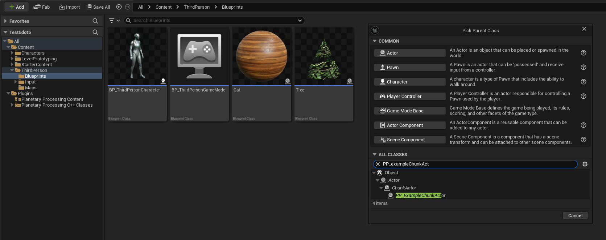

# Unreal

Follow these steps to quickly set up and start using Planetary Processing with your Unreal Engine 5 game. For more detailed information on both the SDK and the server-side API, please visit our [documentation](https://docs.planetaryprocessing.io/).

## Unreal Engine Version

We recommend using the latest Unreal Engine 5 version. If you are using an older version, you must use at least Unreal Engine 5.4+&#x20;

## Operating Systems

The PP Unreal plugin supports macOS or Windows. It does not currently support Linux.

## Create a Planetary Processing Game

1. Navigate to the [games section of our web panel](https://panel.planetaryprocessing.io/games).
2. Click **Create Game** in the top right.
3. Provide the details of your game.&#x20;
   1. Select a **Chunk Size** of 6400. UE5's coordinate system is measured in centimetres. Therefore we should select a large chunk size (equivalent to 64 meters).
   2. Upon the game's creation, you will be taken to your Game Dashboard.
4. For this quick start, we will be using **Anonymous Auth**, which allows players to connect without a username and password. To enable this, navigate to the settings section of your Game Dashboard and enable Anonymous Auth as the Player Authentication Type within Game Settings.


## Clone your Game Repository

1. Clone the [git](../server/git.md) repository as listed in your game dashboard - this is your Planetary Processing backend code.

```sh
git clone https://git.planetaryprocessing.io/git/aBcDE/my-planetary-processing-game.git
```

## Setting Up Your Unreal Engine 5 Project

Open UE5 and start a new project. For this quickstart we will use the Third Person template and make a blueprint project. You may use any tempate of your choice.

<figure><figcaption></figcaption></figure>

You must first download the Planetary Processing plugin files from our website, you will need to be logged into your Planetary Processing account to do so, the link is: [https://files.planetaryprocessing.io/builds/downloads/artefactid/107/version/latest/dist/dist.tar](https://files.planetaryprocessing.io/builds/downloads/artefactid/107/version/latest/dist/dist.tar)

Or use a legacy version: [5.4](https://drive.google.com/drive/folders/1qgiDb0X0n63Lh0JDH5kIcvHy93v7AH-E?usp=drive_link).

You'll need then to extract this and move the contents of the `lib` directory into a directory called `PlanetaryProcessing` in the `Plugins` directory at the root level of your project. You'll need to create the Plugins directory if it does not already exist.

In the UE5 editor, go to Edit and select Plugins. Search for and enable Planetary Processing. If it does not appear at first, try restarting the UE5 editor.

<figure><figcaption></figcaption></figure>

With the plugin enabled, you should be able to see the Planetary Processing plugin content in the Content Browser. Make sure you have 'Show plugin Content' ticked in the Content Browser Settings.

<figure><figcaption></figcaption></figure>

## Using the Planetary Processing Plugin

First navigate to the Planetary Processing Content folder in Plugins and open the PP\_ExamplePlayerController blueprint. Find the Event BeginPlay chain at the top of the blueprint and edit the Init function to have the same Game ID as your Planetary Processing panel game. Remember to always compile and save before closing.

<figure><figcaption></figcaption></figure>

Navigate to your game controller. In the third person template this is BP\_ThirdPersonGameMode and can be found in All/Game/ThirdPerson/Blueprints. Open it and set the Player Controller Class to PP\_ExamplePlayerController.&#x20;

<figure><figcaption></figcaption></figure>

## Creating Entities

Entities populate your game world. Every Entity has a ‘Type’. These Entity Types are defined in the backend code downloaded from your game repository.

1. Navigate back to your cloned game repository.
2. Locate the ‘entity’ folder.
3. Make note of the names of the .lua files inside the ‘entity’ folder. These are your Entity Types.


For the demo game repository, the Entity Types: cat, tree, and player are used. The ‘player’ type represents other players in the game. It is also used for the main player character's server backend.

Lets make a blueprint for our tree entity. Go to /All/Game/ThirdPerson/Blueprints and create a new blueprint class. Search for and select PP\_ExampleEntityActor. Name this blueprint 'Tree'.

<figure><figcaption></figcaption></figure>

Open this blueprint and make some edits of your choice. In this example we only have the starter content, so we will switch the static mesh to a Shape\_Cone and the material to M\_Bush. We will also increase the scale to 3 in all directions.

<figure><figcaption></figcaption></figure>

Register this new entity by going to PP\_ExamplePlayerController in the Plugins folder and selecting EntityMap in the Variables section. Add an element called 'tree' and set the blueprint to our new Tree blueprint. Note that the element name must be the same as a lua Entity Type in the backend ('tree' to match 'tree.lua').

<figure><figcaption></figcaption></figure>

We can follow the same process to make a blueprint for the cat entity if we so wished. Likewise, we can also make new entities in the backend and set them up in Unreal Engine in the same manner.

<figure><figcaption></figcaption></figure>

Any props, actors, terrain and other similar entities that you want to be shared between players must be setup as an entity, like we did with the tree.&#x20;


## Creating Players

Other players are also considered to be entities in your main player character's world. They have the entity type 'player'.&#x20;

However the main player character also shares the type 'player'. So a player actor will automatically be spawned, even though we are already using the BP\_ThirdPersonCharacter.

Create the player entity blueprint, in the same way as other entities. Then open PP\_ExamplePlayerController and go to the Entity Actor Spawning section. Get the ID of the new entity being spawned to check if it matches the UUID of the main player character connection. If it does, set its actor's mesh visibility to nothing. This will hide the main player character's entity, without losing access to its entity data from the server.

<figure><figcaption></figcaption></figure>


## (Optional) Creating Chunks

Chunks are the segments your game world is divided into. They do not need a physical representation in your game but you may choose to use them for storing data about the world, such as information about terrain.

Like for our entity, we can make a blueprint for our chunk. Go to /All/Game/ThirdPerson/Blueprints and create a new blueprint class. Search for and select PP\_ExampleChunkActor. Name this blueprint 'Chunk'.

<figure><figcaption></figcaption></figure>

Open this blueprint and make some edits of your choice. Most of the time chunks will not need a mesh, since they act primarily as a data store.&#x20;

Initially however, to better visualise the world scale, set the static mesh to a Pillar\_50x500 and the material to M\_Statue. We will also increase the scale to 20 in the Z direction.&#x20;

<figure><figcaption></figcaption></figure>

Register the chunk blueprint by going to PP\_ExamplePlayerController in the Plugins folder and selecting ChunkMap in the Variables section. Add an element called 'chunk' and set the blueprint to our new 'Chunk' blueprint.&#x20;

Also select ChunkSize from the Variables section and set its value. It should be the same as the Chunk Size of your [Planetary Processing game](unreal.md#create-a-planetary-processing-game) (eg. 6400).

<figure><figcaption></figcaption></figure>


## Editing your backend code

Using the [repo](unreal.md#clone-your-game-repository) we cloned earlier you can edit the behaviour of entities by changing their Lua file within the ‘entity’ directory. The player.lua file handles client connections from the PP\_ExamplePlayerController.&#x20;

Edit the default demo code, so that the player on the game server receives the world coordinates from the client, and moves to that position.

1. Navigate back to your cloned game repository.
2. Locate the ‘entity’ folder.
3. Open the player.lua file and replace it with the code below.

```lua
-- init called on creation of entity
local function init(self)
    -- set player to a chunkloader, though this is technically unnecessary as the game engine will force this regardless
    self.Chunkloader = true
    self.Data.hello = "hello"
end

-- update called each simulation step, with dt being the number of seconds since last step (float)
local function update(self, dt)
end

-- called when this entity receives a message
-- as this is the player entity it can also receive messages from the game client
local function message(self, msg)
    -- if this is a client message (i.e. from a game client) then look in the message's Data table
    if msg.Client then
        local x, y, z = msg.Data.x, msg.Data.y, msg.Data.z
        self:MoveTo(x, y, z)
    end
end

-- entity file must return table of this format
return { init = init, update = update, message = message }

```

## Push your Planetary Processing backend code to the game repository

After configuring your game entities and logic, [push your changes](../server/git.md) to the game repository:

```sh
git add .
git commit -m "Configure game entities and logic for Planetary Processing"
git push
```

## Deploy Latest Version in the Web UI

1. Go back to your game dashboard in our web panel
2. From the actions menu in the top right, stop the game if it's running.
3. Select "Deploy Latest Version" - this will roll out your updated server-side code.

## Test your Connection

Your player should now be synced with the Planetary Processing back end.&#x20;

1. Test this by selecting 'Start Game' game from the actions menu in the top right of your game's web panel.&#x20;
2. Press play in the UE5 editor.&#x20;

You should be greeted with the Planetary Processing template login screen. If you are using **username and password authentication** (available in the Game Settings section of your panel game), enter the login details for a player. If you are using **anonymous authentication**, just press login. You can remove the login widget from the PP\_ExamplePlayerController blueprint if you so wish.

Once logged in, you should now be able to move your player and see its position updated on the panel map.&#x20;

<figure><figcaption></figcaption></figure>

We recommend [experimenting](../server/entities.md) here to get a sense of what you can do with Planetary Processing. When you add or change entities, make sure your server-side changes match up with your game engine client.

## Play and update your game

Make more changes to your game server as you see fit. You can change how many and what entities are spawned in the init.lua file.&#x20;

1. Make changes to your game repository, then push and deploy them.
2. Reset the simulation state in the Admin section of your game panel.
3. Start up your game again in Unreal Engine 5 and in the web panel, to see the changes you have made!
4. If you want to learn more about updating your server-side code, check out our server-side tutorial video:\
   [https://www.youtube.com/watch?v=QYWtedo1kr4\&list=PLW5OY4K85Qhn7lwZeSPVZXH\_Lg5IwhjNC](https://www.youtube.com/watch?v=QYWtedo1kr4\&list=PLW5OY4K85Qhn7lwZeSPVZXH_Lg5IwhjNC)


## Troubleshooting

If you have encountered any issues, we have a premade demo of this guide:\
[https://drive.google.com/drive/folders/1hhNZyH-FRaf3wahOL7tD\_dOxS\_0L-vUR?usp=drive\_link](https://drive.google.com/drive/folders/1hhNZyH-FRaf3wahOL7tD_dOxS_0L-vUR?usp=drive_link)\
\
If you have further questions, please get in touch on our [Discord](https://pp.vg/discord).
