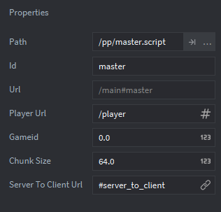
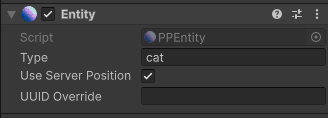

# Defold

The Defold SDK integrates our multiplayer platform with Defold. The plugin provides components and messages to use within your game client code - these communicate changes in state from your server side simulation to the game client itself.

If you are new here, we recommend starting with the [Defold Quickstart Guide](../quick-start/defold.md).

## Installation

The Defold SDK can be installed by navigating to your `game.project` file, then in the 'Project' tab (in the Editor window) you will see the 'Dependencies' list.

You need to add the following dependencies:

* [The Planetary Processing SDK](https://github.com/Planetary-Processing/defold-sdk): `https://github.com/Planetary-Processing/defold-sdk/archive/master.zip`
* [Defold Websocket](https://github.com/defold/extension-websocket), which we depend on: `https://github.com/defold/extension-websocket/archive/master.zip`
* [Defold Protobuf](https://github.com/Melsoft-Games/defold-protobuf), which we depend on: `https://github.com/Melsoft-Games/defold-protobuf/archive/master.zip`


You need then to fetch dependencies, this is done with the 'Fetch Libraries' button under 'Project' in the topbar.


The Defold Websocket library has additional [configuration settings](https://github.com/defold/extension-websocket/blob/master/docs/index.md#configuration). Check there is a 'Websocket' tab in your game.project file, with the 'Debug' and 'Socket Timeout' settings.

<figure><figcaption></figcaption></figure>

If these settings are missing, edit your `game.project` file in a text editor and add the options to it manually.&#x20;

```
[websocket]
debug = 1
socket_timeout = 10000000
```

### Example Project

You can find an example project in the same repo as the library, on our [GitHub](https://github.com/planetary-processing/defold-sdk).


## Components

The Defold SDK provides three new components which can be added to GameObjects. These are [Master](defold.md#master-component), [Entity](defold.md#entity-component) and [Chunk](defold.md#chunk-component).

### Master Component

The Master Component represents the main connection point to PP's servers and performs the heavy lifting and orchestration of the SDK. You must have a GameObject in your game which has the [Master Component](defold.md#pp-master).

Factories to produce [Entities](defold.md#entity-component) and [Chunks](defold.md#chunk-component) must be attached to the same GameObject as the Master Component. Entity factories should be named after the[ Entity Type](../server/entities.md#types-and-behaviour-scripting) in the format `typenamefactory`  as in the example below for the types `cat`, `player` and `tree`.

<figure><figcaption><p>Defold Master</p></figcaption></figure>

Within the Master Component you will need to set the URL of the local player GameObject, the [Chunk Size](https://panel.planetaryprocessing.io/games), and the Planetary Processing [Game ID](https://panel.planetaryprocessing.io/games).

<figure><figcaption></figcaption></figure>

* **Player URL** - Your local player will be represented by a GameObject at this URL.
* **Game ID** - The ID of your game from the [web panel](https://panel.planetaryprocessing.io/games), for Defold to connect to.
* **Chunk Size** - The size of chunks in your game, defined in the [web panel](https://panel.planetaryprocessing.io/games) game settings.
* **Server To Client URL**- A GameObject or script at this URL, which receives manual messages from the game [server to the client](defold.md#pp_server_to_client-receive-manual-server-messages).


### Entity Component

For every [type of Entity](../server/entities.md#types-and-behaviour-scripting) you wish to display in the Defold client, you must create a GameObject file containing the Entity Component. These will act as protypes. These Entity prototypes will be spawned into your world, by factories attached to the Game Object with the [Master Component](defold.md#pp-master).

Other players in the game are also represented as Entities, using the `player` [Entity Type](../server/entities.md#types-and-behaviour-scripting). The local player, controlled by the person playing your game, is not a prototype. It should instead be a separate GameObject in your collection, however **it also needs an** [**Entity Component**](defold.md#pp-entity)**.**

By default, entities will be moved to their server-side position, you can disable this per entity type by un-ticking 'Use Server Position' in the entity component's config window. Should you not want this, you can still keep track of the server position using [Messages](defold.md#messages).

<figure><figcaption><p>Defold Entity Component</p></figcaption></figure>


### Chunk Component

Like the entity component, if you wish to represent chunk data in the Defold client, you must create a GameObject file containing the [Chunk Component](defold.md#pp-chunk). This will act as a protype. The chunk prototype will be spawned into your world as an invisible object, by a factory attached to the Game Object with the [Master Component](defold.md#pp-master).

Chunks are static and invisible. A chunk object will spawn at the origin of each loaded chunk. Chunk objects are optional and you can create a game without them if you wish.

<figure><figcaption><p>Defold Chunk Component</p></figcaption></figure>


## Messages

Messages can be sent to and from your game server along a connection,. Messages to the server are sent to the [Master Component](defold.md#pp-master). Messages from the server are sent to each entity, and the [listener](defold.md#listener) (the script which sent the [`pp_init`](defold.md#pp_init-establish-a-connection) message). Each of these message use a message\_id, such as [`pp_init`](defold.md#pp_init-establish-a-connection), [`pp_join`](defold.md#pp_join-join-with-a-player), [`pp_update`](defold.md#pp_update-receive-server-messages), or [`pp_message`](defold.md#pp_message-send-messages-to-the-server).

There is 2KB limit on the size of messages in Defold, which affects the amount of data which can be transferred from the server. If your message buffer is being overloaded, reduce the amount of Data stored in each individual entity.


### [pp\_init](defold.md#pp-master) -  (Establish a connection)

The first thing you need to do when your game starts is initialise the SDK, to do this you send the [Master Component](defold.md#pp-master) (or its whole GameObject) a message with ID `hash("pp_init")`. The sender url of this message will be allocated as the '[listener](defold.md#listener)' and will be sent all updates in future.&#x20;

```lua
msg.post("/go_with_master_component", hash("pp_init"), {})
```

If you are using authentication, you should supply username and password in a table like so:

```lua
{
    username="Xx_CoolDude69420_xX",
    password="P455W0RD"
}
```


### [pp\_join](defold.md#pp-master) - (Join with a player)

By default, the player will not have joined the world, in order to do this, you should send an empty message with ID `hash("pp_join")` to the master component (or its GameObject).

```lua
msg.post("/go_with_master_component", hash("pp_join"))
```

The [`pp_join`](defold.md#pp-master) message will fail if it is called too soon after the [`pp_init`](defold.md#pp-master) and before the connection is fully established. To avoid this , either trigger the [`pp_join`](defold.md#pp-master) once a [`pp_connected`](defold.md#listener) message has been received, or on input from the person playing.

<pre class="language-lua"><code class="lang-lua">-- Join immediately once connection has been established by pp_init
function on_message(self, message_id, message, sender)
	if message_id == hash("pp_connected") then
		msg.post("/go_with_master_component", hash("pp_join"))
<strong>	end
</strong><strong>end
</strong><strong>
</strong><strong>-- Or join on input, using an input key defined in game.input_binding
</strong>function on_input(self, action_id, action)
	if action_id == hash("key_space") and action.pressed then
		msg.post("/go_with_master_component", hash("pp_join"))
	end
end
</code></pre>


### [pp\_update](defold.md#pp-entity) - (Receive server messages)

The Planetary Processing SDK sends and receives several different messages and accepts several too. Each time an [entity](defold.md#pp-entity) or [chunk](defold.md#pp-chunk) updates its position or data, a message with ID `hash("pp_update")` is sent to that entity's GameObject and the [listener](defold.md#listener).

This message is of the following format: \
(the same format is also used for [`pp_spawn`](defold.md#listener) and [`pp_delete`](defold.md#listener) messages)

| Field | Type     | Description                  |
| ----- | -------- | ---------------------------- |
| uuid  | `string` | UUID of the entity.          |
| x     | `float`  | X coordinate in world units. |
| y     | `float`  | Y coordinate in world units. |
| z     | `float`  | Z coordinate in world units. |
| data  | `table`  | Data of the entity.          |
| type  | `string` | Type of the entity.          |

The example below shows an update message being handled by printing out all the key-value pairs in the message's data table.

```lua
function on_message(self, message_id, message, sender)
    if message_id == hash("pp_update") then
        for key, value in pairs(message.data) do 
            print(key, "=", value)
        end
    end
end
```


### [pp\_message](defold.md#pp-master) - (Send messages to the server)

If you wish to send a message to the server, it must be sent to the [Master Component](defold.md#pp-master) (or its whole GameObject). It will be received by the player entity (player.lua) on the server. All messages are handled by the player entity's [message ](../server/entities.md#message)function on the server side API. Messages from the client can be identified by the [Client field](../server/entities.md#message). To use, send a message with ID `hash("pp_message")` to the [Master Component](defold.md#pp-master) where the [message content](../server/entities.md#message) is the Lua table to be sent as a message.

```lua
msg.post("go_with_master_component", hash("pp_message"), {test=123})
```


### [pp\_server\_to\_client](defold.md#server-to-client) - (Receive manual server messages)

Messages can be manually sent to a specific client from the game server using [`api.client.Message()`](../api-reference/client-api/message.md). These message can be received by a designated [Server To Client Object](defold.md#master-component). This GameObject needs a custom script, which receives the server message to its `on_message()` function with the hash [`pp_server_to_client`](defold.md#pp_server_to_client-receive-manual-server-messages).

```lua
function on_message(self, message_id, message, sender)
	if message_id == hash("pp_server_to_client") then
		print(message.message)
	end
end
```


## API

Below are reference tables of the API available within Defold's environment.

The [Master](defold.md#pp-master), [Entity](defold.md#pp-entity), and [Chunk](defold.md#pp-chunk) components each receive various message hashes, which can be sent from scripts by posting to the component object like so:

```lua
msg.post("go_with_master_component", hash("pp_example"), {example="parameter"})
```

Messages sent to component scripts are relayed directly to the game server.&#x20;

Hashes from the server are received like so:

```lua
function on_message(self, message_id, message, sender)
    if message_id == hash("example_pp") then
        print(message)
    end
end
```


### /pp/master

#### Send to component:

| Message Hash    | Parameters                                                                                                                | Description                                                                                               |
| --------------- | ------------------------------------------------------------------------------------------------------------------------- | --------------------------------------------------------------------------------------------------------- |
| `pp_init`       | <p><code>table({</code></p><p><code>username: string</code></p><p><code>password: string</code></p><p><code>)}</code></p> | Connect to and authenticate with the Planetary Processing servers. Use an empty table for Anonymous Auth. |
| `pp_join`       | None.                                                                                                                     | Spawn your player into the world.                                                                         |
| `pp_message`    | `table`                                                                                                                   | Send a message to your server-side player script.                                                         |
| `pp_disconnect` | None.                                                                                                                     | Disconnect from PP's servers.                                                                             |

***


### /pp/entity

Received by component:

| Message Hash | Parameters                                                                                                                                                                                                                      | Description                                                              |
| ------------ | ------------------------------------------------------------------------------------------------------------------------------------------------------------------------------------------------------------------------------- | ------------------------------------------------------------------------ |
| `pp_update`  | <p><code>table({</code></p><p><code>uuid: string</code><br><code>x: float</code></p><p><code>y: float</code></p><p><code>z: float</code></p><p><code>data: table</code></p><p><code>type: string</code> <br><code>)}</code></p> | An update message containing changes to this entity's server-side state. |

***


### /pp/chunk

Received by component:

| Message Hash | Parameters                                                                                                                                                                                                                      | Description                                                                       |
| ------------ | ------------------------------------------------------------------------------------------------------------------------------------------------------------------------------------------------------------------------------- | --------------------------------------------------------------------------------- |
| `pp_update`  | <p><code>table({</code></p><p><code>uuid: string</code><br><code>x: float</code></p><p><code>y: float</code></p><p><code>z: float</code></p><p><code>data: table</code></p><p><code>type: string</code> <br><code>)}</code></p> | An update message each tick containing changes to this chunk's server-side state. |

***


### Listener

Received by script, which called `pp_init`:

| Message Hash          | Parameters                                                                                                                                                                                                                      | Description                                                                   |
| --------------------- | ------------------------------------------------------------------------------------------------------------------------------------------------------------------------------------------------------------------------------- | ----------------------------------------------------------------------------- |
| `pp_update`           | <p><code>table({</code></p><p><code>uuid: string</code><br><code>x: float</code></p><p><code>y: float</code></p><p><code>z: float</code></p><p><code>data: table</code></p><p><code>type: string</code> <br><code>)}</code></p> | A message containing changes to all entities' and chunks' server-side states. |
| `pp_spawn`            | <p><code>table({</code></p><p><code>uuid: string</code><br><code>x: float</code></p><p><code>y: float</code></p><p><code>z: float</code></p><p><code>data: table</code></p><p><code>type: string</code> <br><code>)}</code></p> | A message when a new entity or chunk spawns.                                  |
| `pp_delete`           | <p><code>table({</code></p><p><code>uuid: string</code><br><code>x: float</code></p><p><code>y: float</code></p><p><code>z: float</code></p><p><code>data: table</code></p><p><code>type: string</code> <br><code>)}</code></p> | A message when an entity or chunk is removed.                                 |
| `pp_connected`        | The connected player's `uuid`.                                                                                                                                                                                                  | A message when the client successfully connects and authenticates.            |
| `pp_disconnected`     | `string`                                                                                                                                                                                                                        | A message when the client disconnects from PP's servers.                      |
| `pp_connection_error` | `string`                                                                                                                                                                                                                        | A message when there is an error during initial connection or authentication. |

***


### Server To Client

Received by script, assigned in Master Component Properties Panel:

| Message Hash          | Parameters | Description                                                                                                                                   |
| --------------------- | ---------- | --------------------------------------------------------------------------------------------------------------------------------------------- |
| `pp_server_to_client` | `table`    | A message manually sent from the server, to this specific player client. Must have its URL assigned in the Master Component Properties Panel. |

