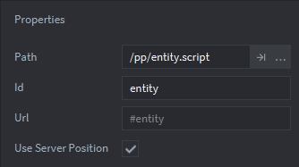

# Defold

## Installation

The Defold SDK can be installed by navigating to your `game.project` file, then in the 'Project' tab (in the Editor window) you will see the 'Dependencies' list.

You need to add the following dependencies:

* [The Planetary Processing SDK](https://github.com/Planetary-Processing/defold-sdk): `https://github.com/Planetary-Processing/defold-sdk/archive/master.zip`
* [Defold Websocket](https://github.com/defold/extension-websocket), which we depend on: `https://github.com/defold/extension-websocket/archive/master.zip`
* [Defold Protobuf](https://github.com/Melsoft-Games/defold-protobuf), which we depend on: `https://github.com/Melsoft-Games/defold-protobuf/archive/master.zip`


You need then to fetch dependencies, this is done with the 'Fetch Libraries' button under 'Project' in the topbar.


## Example Project

You can find an example project in the same repo as the library, on our [GitHub](https://github.com/planetary-processing/defold-sdk).

## Components

The Defold SDK provides two new components which can be added to GameObjects. These are master and entity.

### Entity Component

For every [type of Entity](../server/entities.md#types-and-behaviour-scripting) you wish to display in the Defold client, you must create a GameObject file containing the Entity Component. These will act as protypes. These Entity prototypes will be spawned into your world, by factories attached to the Game Object with the [Master Component](defold.md#master-component).

Other players in the game are also represented as Entities, using the `player` [Entity Type](../server/entities.md#types-and-behaviour-scripting). The local player, controlled by the person playing your game, is not a prototype. It should instead be a separate GameObject in your collection, however **it also needs an Entity Component.**

By default, entities will be moved to their server-side position, you can disable this per entity type by un-ticking 'Use Server Position' in the entity component's config window. Should you not want this, you can still keep track of the server position using [Messages](defold.md#messages).

<figure><figcaption><p>Defold Entity Component</p></figcaption></figure>

### Master Component

The Master Component represents the main connection point to PP's servers and performs the heavy lifting and orchestration of the SDK. You must have a GameObject in your game which has the Master Component.

Factories to produce Entities must be attached to the same GameObject as the Master Component. These factories should be named after the[ Entity Type](../server/entities.md#types-and-behaviour-scripting) in the format`typenamefactory` as in the example below for the types `cat`, `player` and `tree`.


Within the Master Component you will need to set the URL of the local player GameObject and the Planetary Processing game ID.


## Messages

Messages can be sent to and from your game server along a connection,. Messages to the server are sent to the [Master Component](defold.md#master-component). Messages from the server are sent to each entity, and the **listener** (the script which sent the [`pp_init`](defold.md#pp_init-establish-a-connection) message). Each of these message use a message\_id, such as [`pp_init`](defold.md#pp_init-establish-a-connection), [`pp_join`](defold.md#pp_join-join-with-a-player), [`pp_update`](defold.md#pp_update-receive-server-messages), or [`pp_message`](defold.md#pp_message-send-messages-to-the-server).


### [pp\_init ](defold.md#message-directory)-  (Establish a connection)

The first thing you need to do when your game starts is initialise the SDK, to do this you send the [Master Component ](defold.md#master-component)(or its whole GameObject) a message with ID `hash("pp_init")`. The sender url of this message will be allocated as the '**listener**' and will be sent all updates in future.&#x20;

```lua
msg.post("/go_with_master_component", hash("pp_init"), {})
```

If you are using authentication, you should supply username and password in a table like so:

```lua
{
    username="Xx_CoolDude69420_xX",
    password="P455W0RD"
}
```


### [pp\_join ](defold.md#message-directory)- (Join with a player)

By default, the player will not have joined the world, in order to do this, you should send an empty message with ID `hash("pp_join")` to the master component (or its GameObject).

```lua
msg.post("/go_with_master_component", hash("pp_join"))
```

The [`pp_join` ](defold.md#message-directory)message will fail if it is called too soon after the [`pp_init` ](defold.md#message-directory)and before the connection is fully established. To avoid this , either trigger the [`pp_join` ](defold.md#message-directory)once a [`pp_connected` ](defold.md#message-directory)message has been received, or on input from the person playing.

<pre class="language-lua"><code class="lang-lua">-- Join immediately once connection has been established by pp_init
function on_message(self, message_id, message, sender)
	if message_id == hash("pp_connected") then
		msg.post("/go_with_master_component", hash("pp_join"))
<strong>	end
</strong><strong>end
</strong><strong>
</strong><strong>-- Or join on input, using an input key defined in game.input_binding
</strong>function on_input(self, action_id, action)
	if action_id == hash("key_space") and action.pressed then
		msg.post("/go_with_master_component", hash("pp_join"))
	end
end
</code></pre>


### [pp\_update ](defold.md#message-directory)- (Receive server messages)

The PP SDK sends and receives several different messages and accepts several too. Each time an entity updates its position or data, a message with ID `hash("pp_update")` is sent to that entity's GameObject and the listener.

This message is of the following format: \
(the same format is also used for [`pp_spawn` ](defold.md#message-directory)and [`pp_delete` ](defold.md#message-directory)messages)

| Field | Type   | Description                  |
| ----- | ------ | ---------------------------- |
| uuid  | string | UUID of the entity.          |
| x     | float  | X coordinate in world units. |
| y     | float  | Y coordinate in world units. |
| z     | float  | Z coordinate in world units. |
| data  | table  | Data of the entity.          |
| type  | string | Type of the entity.          |

The example below shows an update message being handled by printing out all the key-value pairs in the message's data table.

```lua
function on_message(self, message_id, message, sender)
    if message_id == hash("pp_update") then
        for key, value in pairs(message.data) do 
            print(key, "=", value)
        end
    end
end
```


### [pp\_message ](defold.md#message-directory)- (Send messages to the server)

If you wish to send a message to the server, it must be sent to the [Master Component ](defold.md#master-component)(or its whole GameObject). It will be received by the player entity (player.lua) on the server. All messages are handled by the player entity's [message ](../server/entities.md#message)function on the server side API. Messages from the client can be identified by the [Client field](../server/entities.md#message). To use, send a message with ID `hash("pp_message")` to the [Master Component ](defold.md#master-component)where the [message content](../server/entities.md#message) is the Lua table to be sent as a message.

```lua
msg.post("go_with_master_component", hash("pp_message"), {test=123})
```


## Message Directory

| Message Hash              | Description                                                                            | Fields                                                                                 |
| ------------------------- | -------------------------------------------------------------------------------------- | -------------------------------------------------------------------------------------- |
| `pp_init`                 | Send this to the master component to connect to the PP servers.                        | For anonymous games, nothing, otherwise: `username` and `password`.                    |
| `pp_join`                 | Send this to the master component to spawn your player into the world.                 | None.                                                                                  |
| `pp_message`              | Send this to the master component to send a message to your server-side player script. | Arbitrary table.                                                                       |
| `pp_disconnect`           | Send this to the master component to disconnect from PP's servers.                     | None.                                                                                  |
| `pp_update`               | Sent to an entity (and the listener) when it changes its server-side state.            | See above table for `pp_update` message format.                                        |
| `pp_spawn`                | Sent to the listener when a new entity spawns.                                         | Same as `pp_update`.                                                                   |
| `pp_delete`               | Sent to the listener when an entity is removed.                                        | Same as `pp_update`.                                                                   |
| `pp_authentication_error` | Sent to the listener when PP fails to authenticate.                                    | Short error string (`error`), an error code (`code`) and a longer message (`message`). |
| `pp_connected`            | Sent to the listener when the client successfully connects and authenticates.          | The connected player's `uuid`.                                                         |
| `pp_disconnected`         | Sent to the listener when the client disconnects from PP's servers.                    | A `message` field explaining cause of disconnection.                                   |
| `pp_connection_error`     | Send to the listener when there is an error during initial connection.                 | The `error` string.                                                                    |
