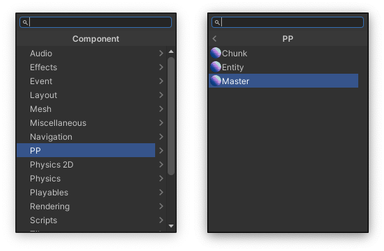
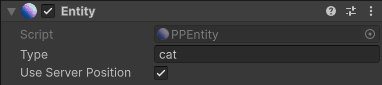
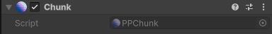

---
layout:
  title:
    visible: true
  description:
    visible: false
  tableOfContents:
    visible: true
  outline:
    visible: true
  pagination:
    visible: true
---

# Unity

The Unity SDK integrates our multiplayer platform with Unity. The plugin provides components and methods to use within your game client code - these communicate changes in state from your server side simulation to the game client itself.

If you are new here, we recommend starting with the [Unity Quickstart Guide](../quick-start/unity.md).

## Installation

The Unity SDK can be installed by opening the Unity Package Manager (Window->Package Manager) and clicking the + on the top left and selecting 'Add package from git URL...'


You then enter the GitHub URL of the PP Unity SDK repository, which is: `https://github.com/Planetary-Processing/unity-sdk.git`

And click 'Add' to add the package.


## Components

The Unity SDK provides three new components which can be added to GameObjects. These are the [Master](unity.md#master-component), [Entity](unity.md#entity-component), and [Chunk](unity.md#chunk-component) components. These can be accessed in the 'Add Component' menu of any GameObject under the 'PP' heading.



### Master Component

[PPMaster](unity.md#ppmaster) represents the main connection point to PP's servers and performs the heavy lifting and orchestration of the SDK. You must have a GameObject in your game which has the Master Component.

To configure the Master Component you will need to set some references to GameObjects and Prefabs or Scenes, in the [PPMaster](unity.md#ppmaster) inspector window.&#x20;


Essential Variables:

* **Player** - Your local player will be represented by a GameObject.
* **Prefabs** - Each Prefab created with the the [Entity Component](unity.md#entity-component) must be added to the Entity 'Prefabs' list in the inspector.
* **Game ID** - The ID of your game from the [web panel](https://panel.planetaryprocessing.io/games), for Unity to connect to.


Optional Variables:

* <mark style="color:yellow;">**(WIP)**</mark>**&#x20;Use Scene Player -** Checkbox for whether to use a GameObject or Scene. GameObject by default
* <mark style="color:yellow;">**(WIP)**</mark>**&#x20;Scene Player Name -** The string name of the scene containing your playe GameObject and PPEntity. Only required if Use Scene Player is enabled. &#x20;
* **Chunk Prefab** - A Prefab with the [Chunk Component](unity.md#chunk-component) to manage Chunks.
* <mark style="color:yellow;">**(WIP)**</mark>**&#x20;Scenes -** If you would rather arrange your entities as scenes, each Scene created with the the [Entity Component ](unity.md#entity-component)must be added to the Entity 'Scenes' list in the inspector.
* **Chunk Size** - The size of chunks in your game, defined in the [web panel](https://panel.planetaryprocessing.io/games) game settings.
* **Two Dimensions** - Automatically adjusts entity positions to use Unity's 2D orientation.
* **Server To Client Object** - A GameObject which receives manual messages from the game [server to the client](unity.md#server-to-client-messaging).

<figure><figcaption></figcaption></figure>

### Entity Component

[PPEntity ](unity.md#ppentity)represents a server-side entity in the game world. You are required to, for every [type ](../server/entities.md#types-and-behaviour-scripting)of entity you wish to display in the Unity client, create a Prefab containing the [PPEntity ](unity.md#ppentity)component.

By default, entities' GameObjects will be moved to their server-side position, you can disable this per entity type by un-ticking 'Use Server Position' in the entity component's inspector window. Here you also need to set the entity's [type](../server/entities.md#types-and-behaviour-scripting), which must match the server-side type that this Prefab represents.

Please note that the `player` [type](../server/entities.md#types-and-behaviour-scripting) is needed only for other players, not the one connecting with this client. For the local player, you need to create a separate GameObject (not in a prefab). The local player also requires a PPEntity component, but not a specific [type](../server/entities.md#types-and-behaviour-scripting) definition in the inspector.

<figure><figcaption><p>Unity Entity Component</p></figcaption></figure>

### Chunk Component

[PPChunk ](unity.md#ppchunk)represents each [chunk ](../server/chunks.md)in the game world. Each chunk has a data table, which is synced down to the client with the [PPChunk ](unity.md#ppchunk)component. To use this, you must create a Prefab with the [PPChunk ](unity.md#ppchunk)component on it, which will be instantiated at the corner of each chunk and will hold its data.

<figure><figcaption><p>Unity Chunk Component</p></figcaption></figure>


## Server To Client Messaging

The [PPEntity](unity.md#ppentity) component automatically receives and syncs all [Entity](../server/entities.md) data from the game world. Any client can access Entity data passed from the server, using [`GetServerData()`](unity.md#ppmaster).

Alternatively, messages can be manually sent to a specific client using [`api.client.Message()`](../api-reference/client-api/message.md). These message can be received by a designated [Server To Client Object](unity.md#master-component). This GameObject needs a custom script component, with a function named [`ServerToClient`](unity.md#custom-scripts), which receives the server message as a parameter.

<pre class="language-csharp"><code class="lang-csharp"><strong>void ServerToClient(Dictionary&#x3C;string, object> message)
</strong>    {
        message.TryGetValue("key", out object value);
    }
</code></pre>


## <mark style="color:yellow;">**(WIP)**</mark> Using Scenes

By default we recommend representing your player with a GameObject in the main scene and Entities with Prefabs spawned in the main scene. However, you may wish to represent your player and entities as Unity Scenes.&#x20;

To do so for the player, you must enable '[**Use Scene Player**](unity.md#master-component)**'** and specify the scene name in '[**Scene Player Name**](unity.md#master-component)**'.** The default '[Player](unity.md#master-component)' field can be left blank, if '[**Use Scene Player**](unity.md#master-component)**'** is enabled.&#x20;

Non-player entities can also be scenes. You can add the scene name for each in the '[**Scenes**](unity.md#master-component)**'** list. The scene name does not have to match the [Entity Type](../server/entities.md#types-and-behaviour-scripting), though we recommend you do for project consistency. An Entity Scene should contain a GameObject with a [PPEntity](unity.md#entity-component) component at the top level of the hierarchy, just as with an Entity Prefab.&#x20;

On the serverside, an Entity Scene functions in the same way as an Entity Prefab. Entity Scenes can be useful for structuring larger games on the Unity client.


## API

Below are reference tables of the API available within Unity's C# environment.

The [PPMaster](unity.md#ppmaster), [PPEntity](unity.md#ppentity), and [PPChunk ](unity.md#ppchunk)components expose various public methods which can be accessed within MonoBehaviour scripts by getting a reference to the component like so:

```csharp
PPMaster master = GetComponent<PPMaster>();
PPEntity entity = GetComponent<PPEntity>();
PPChunk chunk = GetComponent<PPChunk>();
```

To connect to the server and join with the player, for example:

```csharp
PPMaster master = GetComponent<PPMaster>();
master.Init("", "");
master.Join();
```

### PPMaster

| Method                     | Parameters                                                            | Return Type    | Description                                                                                                        |
| -------------------------- | --------------------------------------------------------------------- | -------------- | ------------------------------------------------------------------------------------------------------------------ |
| `Init(username, password)` | <p><code>username: string</code><br><code>password: string</code></p> | None           | Connect to and authenticate with the Planetary Processing servers.                                                 |
| `Join()`                   | None                                                                  | None           | Spawn the player into the world.                                                                                   |
| `Message(msg)`             | `msg: Dictionary<string, object>`                                     | None           | Send a message to the player entity on the server, to be handled by the `message` function on the server side API. |
| `GetEntity(uuid)`          | `uuid: string`                                                        | `Entity`       | Get Entity details by UUID.                                                                                        |
| `GetEntities()`            | None                                                                  | `List<Entity>` | Get a list of all Entities that this client can see.                                                               |


### PPEntity

| Method                | Parameters | Return Type                  | Description                                                                                                                                                                                                                                                     |
| --------------------- | ---------- | ---------------------------- | --------------------------------------------------------------------------------------------------------------------------------------------------------------------------------------------------------------------------------------------------------------- |
| `GetServerPosition()` | None       | `Vector3`                    | Get the server-side position of this entity. Particularly useful if you are not using the 'Use Server Position' feature. **NOTE: Planetary Processing uses 'y' for depth in 3 dimensional games, and 'z' for height, the Unity SDK automatically swaps these.** |
| `GetServerData()`     | None       | `Dictionary<string, object>` | Get the server-side data of this entity.                                                                                                                                                                                                                        |
| `GetUUID()`           | None       | `string`                     | Get this entity's UUID.                                                                                                                                                                                                                                         |


### PPChunk

| Method            | Parameters | Return Type                  | Description                             |
| ----------------- | ---------- | ---------------------------- | --------------------------------------- |
| `GetServerData()` | None       | `Dictionary<string, object>` | Get the server-side data of this chunk. |


### Custom Scripts

| Method             | Parameters                            | Return Type | Description                                                                                           |
| ------------------ | ------------------------------------- | ----------- | ----------------------------------------------------------------------------------------------------- |
| `ServerToClient()` | `message: Dictionary<string, object>` | None        | Receives manual messages from the server. Must be assigned to a GameObject in the PPMaster inspector. |

