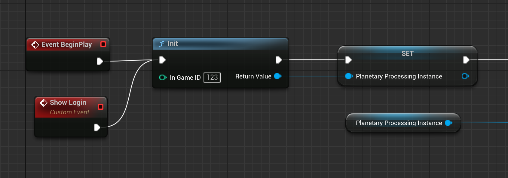
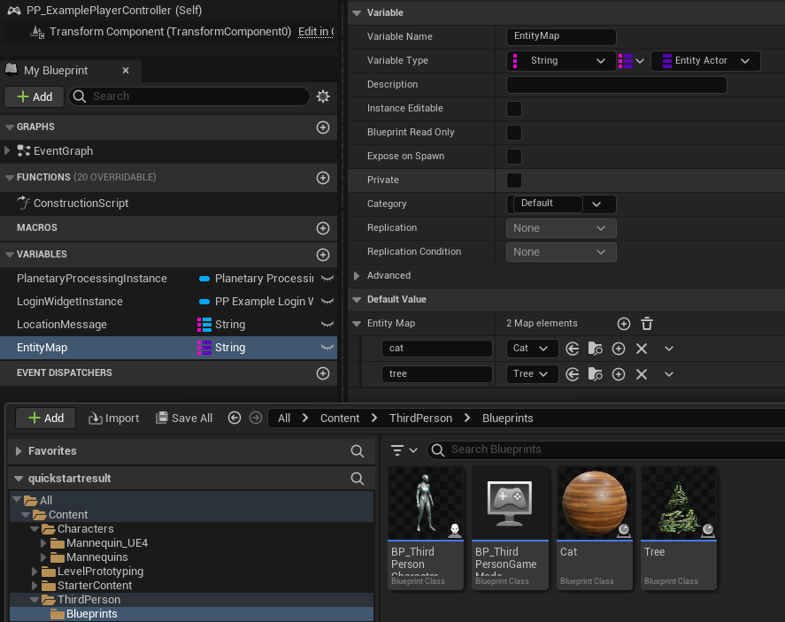
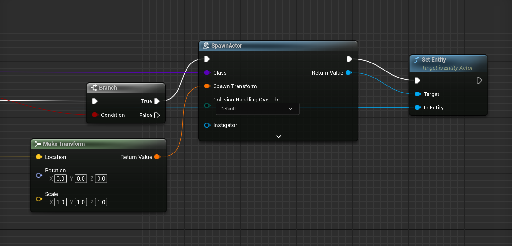
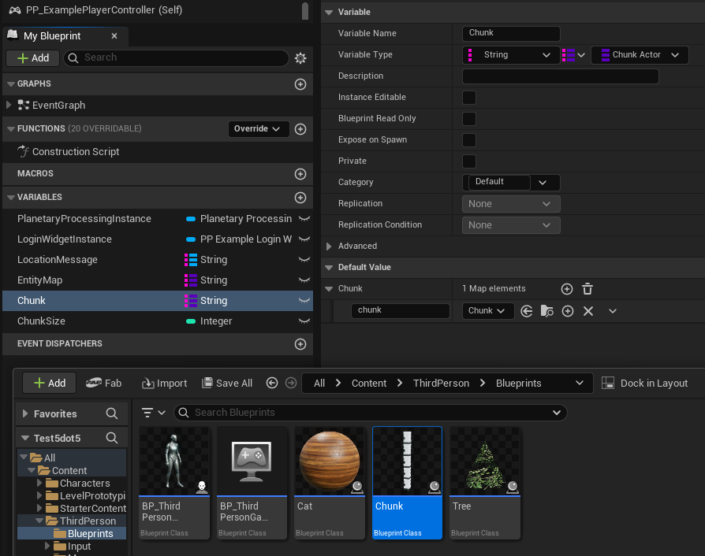
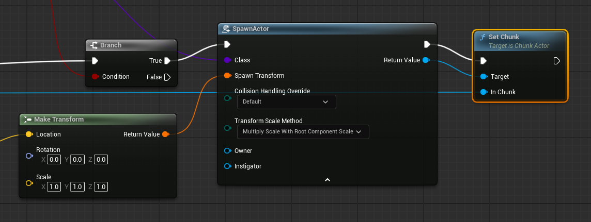
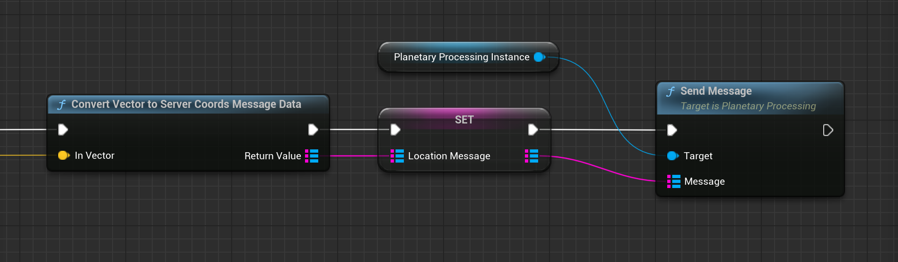
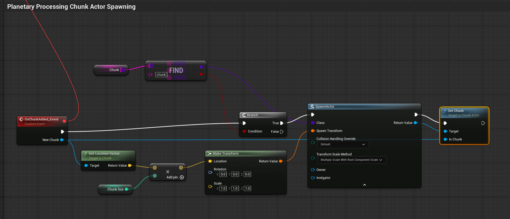

# Unreal

## Introduction

Planetary Processing provides a plugin for Unreal Engine 5. The plugin consists of a number of C++ classes for use in connecting players to your game simulation, as well as communicating simulation state to your game client and messages from the client to your simulation.

### Pre-requisites

* Unreal Engine 5.4+&#x20;
* macOS or Windows, the PP Unreal plugin does not currently support Linux.

### Installation

To install the Planetary Processing plugin, you must first download the plugin files from our website, you will need to be logged into your Planetary Processing account to do so, the link is: [https://files.planetaryprocessing.io/builds/downloads/artefactid/107/version/latest/dist/dist.tar](https://files.planetaryprocessing.io/builds/downloads/artefactid/107/version/latest/dist/dist.tar)

Or use a legacy version: [5.4](https://drive.google.com/drive/folders/1qgiDb0X0n63Lh0JDH5kIcvHy93v7AH-E?usp=drive_link).

You'll need then to extract this and move the contents of the `lib` directory into a directory called `PlanetaryProcessing` in the `Plugins` directory at the root level of your project. You'll need to create the Plugins directory if it does not already exist.

You can now enable the Planetary Processing plugin for your Unreal Engine 5 project. You will be required to restart the engine once you enable the plugin.

## Classes

### PlanetaryProcessing Class

This class is the core of the Planetary Processing plugin. It handles initialization, connection to the server, authentication, message sending, and state updates from the server. This class is intended to be used as a singleton, and instantiated via the [Init](unreal.md#planetaryprocessing-class-1) static function.

<figure><figcaption></figcaption></figure>

### Entity Class

This class represents an [Entity](../server/entities.md) in the Planetary Processing system. It contains all the [data](unreal.md#entity-class-1) of the corresponding entity on your game server. The [Entity Types](../server/entities.md#types-and-behaviour-scripting) can be matched up with the [EntityActor](unreal.md#entityactor-class) class using the [Entity Map](unreal.md#entity-actor-spawning) variable.

<figure><figcaption></figcaption></figure>

### EntityActor Class

This class extends the Unreal Engine Actor class, spawning an Actor in your game client based on an [Entity](../server/entities.md) from your game simulation. You are intended to subclass [Entity Actor](unreal.md#entity-actor-spawning) to create Actors for each of your [Entity Types](../server/entities.md#types-and-behaviour-scripting). As an example, a 'Tree' class could be an [Entity Actor](unreal.md#entity-actor-spawning) for a 'tree' [Entity Type](../server/entities.md#types-and-behaviour-scripting). Meanwhile a 'Cat' class could be a completely different [Entity Actor](unreal.md#entity-actor-spawning) with a separate mesh component and behaviours.

<figure><figcaption></figcaption></figure>

The [EntityActor](unreal.md#entity-actor-spawning) class is intended to have an [Entity](unreal.md#entity-class-1) associated with it once created, via [SetEntity](unreal.md#entity-actor-spawning). With this set, the [EntityActor](unreal.md#entity-actor-spawning) class will automatically broadcast [OnUpdated](unreal.md#pp_exampleentityactor) and [OnRemoved](unreal.md#pp_exampleentityactor) events accordingly, as its associated [Entity](unreal.md#entity-class-1) is either updated or removed.

<figure><figcaption></figcaption></figure>

### ChunkActor Class

Use of this class is optional. Similar to the [Entity Actor](unreal.md#entityactor-class), this class spawns an Actor in your game client. If used, an Actor is spawned at the bottom-left corner of every [Chunk](../server/chunks.md) in your game simulation.&#x20;

The main purpose of the [Chunk Actor](unreal.md#chunk-actor-spawning) is to store information, such as data about nearby terrain. In most cases the [Chunk Actor](unreal.md#chunk-actor-spawning) will not need a mesh, since it cannot move or act.&#x20;

<figure><figcaption></figcaption></figure>

Chunks only have one type, 'chunk'. A subclass of [Chunk Actor](unreal.md#chunk-actor-spawning) must be defined in the Chunk Map using the key 'chunk'. You must also define the Chunk Size integer variable, using the chunk size set in your [online game](https://panel.planetaryprocessing.io/games).

<figure><figcaption></figcaption></figure>

The [ChunkActor](unreal.md#chunk-actor-spawning) class is intended to have an [Chunk](../server/chunks.md) associated with it once created, via SetChunk. With this set, the [ChunkActor](unreal.md#chunk-actor-spawning) class will automatically broadcast [OnUpdated](unreal.md#pp_examplechunkactor) and [OnRemoved](unreal.md#pp_examplechunkactor) events accordingly, as its associated Chunk is either updated or goes out of range of a Chunkloader.

### MessageData Class

The [MessageData](unreal.md#send-player-coordinates-message) class is designed to serve as a flexible container for arbitrary data, akin to JavaScript objects. Its primary purpose is twofold:

* **Deserialization from JSON:** It allows update messages received from the server in JSON format to be efficiently parsed and stored in a way that can be accessed within Unreal Engine. This ensures that the data stored on each [Entity](unreal.md#entity-class-1) (strings, numbers, booleans, arrays and nested objects) can be translated into native Unreal Engine data structures.
* **Serialization to JSON:** Conversely, the class enables the construction of arbitrary data structures which can be serialized and sent to the server as the body of the message in a [SendMessage](unreal.md#send-player-coordinates-message) call.

Hence it can be used in [Blueprints](unreal.md#blueprints) to both access data on [Entity](unreal.md#entity-class-1) instances and construct messages for [SendMessage](unreal.md#send-player-coordinates-message).&#x20;

If you want to handle serialization and deserialization yourself, without [MessageData](unreal.md#send-player-coordinates-message), the original JSON of an [Entity](unreal.md#entity-class-1) is available in the [DataJSON](unreal.md#entity-class-1) property of that class. Raw JSON messages can also be sent using the [SendJSONMessage](unreal.md#planetaryprocessing-class-1) function of the [PlanetaryProcessing](unreal.md#planetaryprocessing-class-1) class.

<figure><figcaption></figcaption></figure>

### Event Class

The [Event](unreal.md#server-to-client-event-messaging-example) Class handles manual server-to-client messaging. Every tick, if a message has been sent from the server using [`api.client.Message()`](../api-reference/client-api/message.md), the Unreal custom event [OnEventReceived\_Event](unreal.md#server-to-client-event-messaging-example) is triggered.&#x20;

Use this to handle data sent to a specific player client, as opposed to entity data which is sent to all player clients.

<figure><figcaption></figcaption></figure>

## Blueprints

The Planetary Processing plugin is packaged with a number of example Blueprints. These serve to show how to carry out some basic functions using the Planetary Processing plugin. These blueprints are [PP\_ExamplePlayerController](unreal.md#pp_exampleplayercontroller), [PP\_ExampleEntityActor](unreal.md#pp_exampleentityactor), and the [PP\_ExampleLoginWidget](unreal.md#pp_exampleloginwidget).

### PP\_ExamplePlayerController

This blueprint demonstrates how to initialize your [Planetary Processing](unreal.md#planetaryprocessing-class-1) instance and then how to carry out the fundamental processes required to make use of it. These include [establishing the connection](unreal.md#authentication), [initializing entities](unreal.md#entity-actor-spawning), [maintaining the connection](unreal.md#connection-error-handling), and [processing messages to](unreal.md#send-player-coordinates-message) and [from the server](unreal.md#update-entities).

#### Authentication

There are two stages to authentication: initializing the connection the game server and joining the validated connection's processing.

Initializing the connection:

1. `Event BeginPlay/Show Login ->  Init -> Set`
   * Initialize the [PlanetaryProcessing](unreal.md#planetaryprocessing-class-1) singleton with a Game ID (Game ID available in the [Planetary Processing Panel](https://panel.planetaryprocessing.io/)).
2. `Create PP Example Login Widget Widget -> Set -> Add to Viewport`
   * Create an instance of [PP\_ExampleLoginWidget](unreal.md#pp_exampleloginwidget) and adds it to the viewport.
3. `Planetary Processing Instance -> Bind Event to On Authenticated -> OnAuthenticated_Event`
   * Bind the connection joining processes to the [OnAuthenticated ](unreal.md#delegates)event triggered from the [PlanetaryProcessing](unreal.md#planetaryprocessing-class-1) singleton.

Joining a valid connection:

1. `OnAuthenticated_Event -> Delay`
   * A short delay ensures subsequent bindings are handled by the game thread.
2. `Login Widget Instance -> Remove from Parent -> Set`
   * Remove the login widget from the viewport.
3. `Unbind All Events from On Authenticated -> Planetary Processing Instance`
   * Unbind all events from the [OnAuthenticated](unreal.md#delegates) event.
4. `Planetary Processing Instance - > Bind Event to On Entity Added -> Bind Event to On Connection Error`
   * Set up bindings to generate the game server world using the [OnEntityAdded](unreal.md#entity-actor-spawning) and [OnConnectionError](unreal.md#connection-error-handling) events from the [PlanetaryProcessing](unreal.md#planetaryprocessing-class-1) singleton.
5. `Start Game -> Start Game (Custom Event)`
   * Continue with game logic, in this case a custom event named StartGame.

#### Entity Actor Spawning

1. `OnEntityAdded_Event -> GetType / Entity Map -> Find`
   * Look up the [EntityActor](unreal.md#entityactor-class-1) class reference in the [EntityMap](unreal.md#pp_exampleplayercontroller-1) variable using the [Entity Type](unreal.md#entity-class-1) from the [OnEntityAdded\_Event](unreal.md#delegates)**.**
2. `GetLocationVector -> Make Transform`
   * Use the [GetLocationVector](unreal.md#entity-class-1) function of the added [Entity](unreal.md#entity-class-1) to create a Vector for the initial location of the [EntityActor](unreal.md#entityactor-class-1).
3. `Find / Branch / Make Transform -> Spawn Actor`
   * If the [Type](unreal.md#entity-class-1) is valid, spawn an instance of the [EntityActor](unreal.md#entityactor-class-1)**.**
4. `OnEntityAdded_Event / Spawn Actor -> Set Entity`
   * Call [SetEntity](unreal.md#entityactor-class-1) on the [EntityActor](unreal.md#entityactor-class-1) to associate it with the [Entity](unreal.md#entity-class-1) that we are representing.

If you wish, you can extend the script to remove spawning for the client player entity. This can be done by adding an extra branch to filter entities with the same ID as the [Planetary Processing](unreal.md#planetaryprocessing-class-1) instance's [UUID](unreal.md#planetaryprocessing-class-1). This only removes the player's own entity from the client, not other players.

<figure><figcaption></figcaption></figure>

#### Chunk Actor Spawning

<figure><figcaption></figcaption></figure>

1. `OnChunkAdded_Event -> Entity Map -> Find`
   * Look up the ChunkActor class reference in the ChunkMap variable using the key 'chunk'**.**
2. `GetLocationVector / Chunk Size -> Multiply -> Make Transform`
   * Use the [GetLocationVector](unreal.md#entity-class-1) function of the added Chunk to get its X and Y values. Multiply these by the Chunk Size to create a Vector for the location of the ChunkActor.
3. `Find / Branch / Make Transform -> Spawn Actor`
   * If the 'chunk' key is in use, spawn an instance of the ChunkActo&#x72;**.**
4. `OnChunkAdded_Event / Spawn Actor -> Set Chunk`
   * Call SetChunk on the ChunkActor to associate it with the Chunk that we are representing.

#### Connection Error Handling

If the connection fails, cease processing the world and return to the authentication login.

1. `OnConnectionError_Event / Planetary Processing Instance -> Unbind All Events from On Entity Added / Planetary Processing Instance -> Unbind All Events from On Connection Error`
   * Unbinds all events from [OnEntityAdded](unreal.md#delegates) and [OnConnectionError](unreal.md#delegates)**.**
2. `Show Login -> Show Login Custom Event`
   * Calls a custom event called [ShowLogin](unreal.md#authentication), which feeds back into the [authentication](unreal.md#authentication) flow above.

#### Update Entities

1. `Planetary Processing Instance -> IsAuthenticated / Event Tick ->  Branch`
   * On each tick, check if the connection is authenticated by calling [IsAuthenticated](unreal.md#functions) on the [PlanetaryProcessing](unreal.md#planetaryprocessing-class-1) instance.
2. `Branch -> Sequence / Planetary Processing Instance -> Update -> OnUpdated_Event`
   * If it is authenticated, call the [Update](unreal.md#functions) function of the [PlanetaryProcessing](unreal.md#planetaryprocessing-class-1) instance to process state changes received.
3. `Sequence -> Send Player Coords -> SendPlayerCoords (Custom Event)`
   * We then also call the [SendPlayerCoords](unreal.md#send-player-coordinates-message) custom event.

#### Send Player Coordinates Message

1. `Send Player Coords (Custom Event) -> ...`
   * Process the message on each [update tick](unreal.md#update-entities) using the [Send Player Coords](unreal.md#update-entities) broadcast.
2. `Get Player Pawn -> Get Actor Location`
   * Get the location of the Player Pawn Actor.
3. `Convert Vector To Server Coords Message Data -> Set`
   * Call the [ConvertVectorToServerCoordsMessageData](unreal.md#functions) static function from the [PlanetaryProcessing](unreal.md#planetaryprocessing-class-1) class. This gives us a map of strings to MessageData values, with the x, y and z values set based on the player position. [ConvertVectorToServerCoordsMessageData](unreal.md#functions) alters these xyz values to match the Planetary Processing coordinate system orientation.
4. `Set / To MessageData (bool) -> Add`
   * Uses the implicit conversion of a boolean to [MessageData](unreal.md#messagedata-class-1) as the value for a new key of _threedee_ in our map.
5. `Add / Planetary Processing Instance / Set -> Send Message`
   * Calls [SendMessage](unreal.md#functions) on our [PlanetaryProcessing](unreal.md#planetaryprocessing-class-1) instance with our message map as an argument.

#### Server to Client Event Messaging (example)

<figure><figcaption>
Receive Server to Client Message
</figcaption></figure>

1. `OnEventReceived_Event (Custom Event) -> Get Map`
   * Get a message map sent to this player client.
2. `Find -> Get String -> Print String`
   * Use a key to find a specific value in the map, and define what data type that value is expected to be. Then print the value.

### PP\_ExampleEntityActor

This blueprint shows how to bind to the [OnUpdated](unreal.md#entityactor-class-1) and [OnRemoved](unreal.md#entityactor-class-1) events for an [EntityActor](unreal.md#entityactor-class-1).

#### Event Binding

1. `Event BeginPlay -> Bind Event to On Updated -> OnUpdated_Event -> Set Actor Location to Entity Coords`
   * Bind to the [OnUpdated](unreal.md#entityactor-class-1) event for the [EntityActor](unreal.md#entityactor-class-1). Calls [SetActorLocationToEntityCoords](unreal.md#entityactor-class-1) to update the Actor's location to match the [Entity](unreal.md#entity-class-1)**.**
2. `Bind Event to On Removed -> OnRemoved_Event -> Destroy Actor`
   * Bind to the [OnRemoved](unreal.md#entityactor-class-1) event for the [EntityActor](unreal.md#entityactor-class-1). Destroys the Actor when this event is broadcast.

For the actor to follow the server-side location, without issue, it must have physics disabled on the clientside.

If you wish to retrieve the location vector of an entity before it is set automatically, you can use the following example. Replace the Print String function with functions of your choice.

<figure><figcaption></figcaption></figure>

### PP\_ExampleChunkActor

This blueprint shows how to bind to the [OnUpdated](unreal.md#entityactor-class-1) and [OnRemoved](unreal.md#entityactor-class-1) events for a ChunkActor.

#### Event Binding

<figure><figcaption></figcaption></figure>

1. `Event BeginPlay -> Bind Event to On Updated -> OnUpdated_Event -> Set Actor Location to Chunk Coords`
   * Bind to the [OnUpdated](unreal.md#entityactor-class-1) event for the ChunkActor. Calls SetActorLocationToChunkCoords to update the Actor's location to match the [Entity](unreal.md#entity-class-1)**.**
2. `Bind Event to On Removed -> OnRemoved_Event -> Destroy Actor`
   * Bind to the [OnRemoved](unreal.md#entityactor-class-1) event for the ChunkActor. Destroys the Actor when this event is broadcast.

### PP\_ExampleLoginWidget

This is a simple login widget which calls the [Connect](unreal.md#planetaryprocessing-class-1) function and displays an error if the connection fails.

#### Login Click

1. `OnClicked (Login_Button) / Error Message Text -> Set Visibility`
   * Hide the error message (effectively resetting the error state of the login form) when clicked.
2. `Username / Password -> GetText  -> Get Planetary Processing Instance / To String (Text) ->  Connect`
   * Call the [Connect](unreal.md#planetaryprocessing-class-1) function on the [PlanetaryProcessing](unreal.md#planetaryprocessing-class-1) instance with the username and password from the login form.

#### Error Handling

1. `Event On Initialized -> Get Planetary Processing Instance -> Bind Event to On Connection Error -> OnConnectionError_Event`
   * Bind to the [OnConnectionError](unreal.md#delegates) event when the widget is initialized.
2. `OnConnectionError_Event / Error Message Text -> Set`
   * Set the error message to be visible when [OnConnectionError](unreal.md#delegates) is broadcast.

## API&#x20;

### PlanetaryProcessing Class

#### Properties

| Name     | Type                      | Description                                                                                           |
| -------- | ------------------------- | ----------------------------------------------------------------------------------------------------- |
| GameID   | int32                     | ID of the game. Editable in Blueprints.                                                               |
| UUID     | FString                   | Authenticated player's unique identifier. Read-only in Blueprints.                                    |
| Entities | TMap\<FString, UEntity\*> | Map of server entities, reflecting the server state as of the latest update. Read-only in Blueprints. |

#### Functions

| Name                                          | Parameters                                       | Return Type                    | Description                                                                                                                                                                                                                                                                                             |
| --------------------------------------------- | ------------------------------------------------ | ------------------------------ | ------------------------------------------------------------------------------------------------------------------------------------------------------------------------------------------------------------------------------------------------------------------------------------------------------- |
| static Init                                   | int32 InGameID                                   | UPlanetaryProcessing\*         | Initializes the Planetary Processing singleton with the given game ID. If called again, the existing Planetary Processing instance will be restored to its initial state and returned.                                                                                                                  |
| static GetInstance                            | None                                             | UPlanetaryProcessing\*         | Gets the singleton instance of the Planetary Processing class.                                                                                                                                                                                                                                          |
| Connect                                       | const FString& Username, const FString& Password | void                           | Connects the player to the server with the provided username and password. Broadcasts **OnAuthenticated** upon successful connection.                                                                                                                                                                   |
| Update                                        | None                                             | void                           | Updates the **Entities** map by processing state updates that the client has received from the server since the last update. Intended to be called once each game tick such that the **Entities** map consists of fresh data. Broadcasts **OnEntityAdded**, **OnEntityUpdated** and **OnEntityRemoved** |
| IsAuthenticated                               | None                                             | bool                           | Returns whether the user is authenticated.                                                                                                                                                                                                                                                              |
| IsConnected                                   | None                                             | bool                           | Returns whether the initial socket connection to the server is active.                                                                                                                                                                                                                                  |
| SendMessage                                   | const TMap\<FString, UMessageData\*>& Message    | void                           | Sends a message to the server, using the **MessageData** format.                                                                                                                                                                                                                                        |
| SendJSONMessage                               | const FString& JsonString                        | void                           | Sends a JSON message to the server. This can be used if your data is already in JSON format and as such can be sent directly.                                                                                                                                                                           |
| Logout                                        | None                                             | void                           | Logs out and disconnects the player from the server.                                                                                                                                                                                                                                                    |
| static ConvertVectorToServerCoords            | const FVector& InVector                          | TMap\<FString, float>          | Converts an Unreal Engine Vector into the coordinate system used in Planetary Processing.                                                                                                                                                                                                               |
| static ConvertVectorToServerCoordsMessageData | const FVector& InVector                          | TMap\<FString, UMessageData\*> | Converts an Unreal Engine Vector into **MessageData** with x, y and z values set in the Planetary Processing coordinate system.                                                                                                                                                                         |

#### Delegates

| Delegate          | Parameter                   | Description                                                                                                                                                                                                          |
| ----------------- | --------------------------- | -------------------------------------------------------------------------------------------------------------------------------------------------------------------------------------------------------------------- |
| OnAuthenticated   | None                        | Fires when player is successfully authenticated.                                                                                                                                                                     |
| OnEntityAdded     | UEntity\* NewEntity         | Fires when a new **Entity** is added to the **Entities** map. This can be used to spawn a new **EntityActor**.                                                                                                       |
| OnEntityUpdated   | UEntity\* UpdatedEntity     | Fires when an existing **Entity** in the **Entities** map is updated. If an **EntityActor** has already been spawned based on this **Entity**, the **EntityActor** will re-broadcast this as an **OnUpdated** event. |
| OnEntityRemoved   | const FString& EntityID     | Fires when an **Entity** is removed from the **Entities** map. If an **EntityActor** has been spawned based on this **Entity**, the **EntityActor** will re-broadcast this as an **OnRemoved** event.                |
| OnConnectionError | const FString& ErrorMessage | Currently a catch-all for connection related errors, including authentication errors, loss of connection, failure to send messages or failure to parse updates.                                                      |

***

### Entity Class

#### Properties

| Name     | Type                           | Description                                        |
| -------- | ------------------------------ | -------------------------------------------------- |
| ID       | FString                        | The unique identifier of the entity.               |
| X        | double                         | X coordinate of the entity.                        |
| Y        | double                         | Y coordinate of the entity.                        |
| Z        | double                         | Z coordinate of the entity.                        |
| Data     | TMap\<FString, UMessageData\*> | Additional data of the entity.                     |
| DataJSON | FString                        | JSON representation of the additional entity Data. |
| Type     | FString                        | Type of the entity.                                |

#### Functions

| Name              | Parameters | Return Type | Description                                                                                                                  |
| ----------------- | ---------- | ----------- | ---------------------------------------------------------------------------------------------------------------------------- |
| GetLocationVector | None       | FVector     | Converts the Planetary Processing X, Y and Z coordinates of this entity into a Vector in the Unreal Engine coordinate system |

***

### EntityActor Class

#### Properties

| Name      | Type                  | Description                                 |
| --------- | --------------------- | ------------------------------------------- |
| Entity    | UEntity\*             | The entity associated with this actor.      |
| OnUpdated | FOnEntityUpdatedEvent | Delegate called when the entity is updated. |
| OnRemoved | FOnEntityRemovedEvent | Delegate called when the entity is removed. |

#### Functions

| Name                           | Parameters         | Return Type | Description                                                                                                                                                                         |
| ------------------------------ | ------------------ | ----------- | ----------------------------------------------------------------------------------------------------------------------------------------------------------------------------------- |
| SetEntity                      | UEntity\* InEntity | void        | Sets the entity for this actor.                                                                                                                                                     |
| SetActorLocationToEntityCoords | None               | void        | Converts the Planetary Processing X, Y and Z coordinates of the associated Entity into a Vector in the Unreal Engine coordinate system and sets the Actor's location to this Vector |

***

### ChunkActor Class

#### Properties

| Name      | Type                 | Description                                |
| --------- | -------------------- | ------------------------------------------ |
| Chunk     | UChunk\*             | The chunk associated with this actor.      |
| OnUpdated | FOnChunkUpdatedEvent | Delegate called when the chunk is updated. |
| OnRemoved | FOnChunkRemovedEvent | Delegate called when the chunk is removed. |

#### Functions

| Name                          | Parameters       | Return Type | Description                                                                                                                                                                        |
| ----------------------------- | ---------------- | ----------- | ---------------------------------------------------------------------------------------------------------------------------------------------------------------------------------- |
| SetChunk                      | UChunk\* InChunk | void        | Sets the chunk for this actor.                                                                                                                                                     |
| SetActorLocationToChunkCoords | None             | void        | Converts the Planetary Processing X, Y and Z coordinates of the associated Chunk into a Vector in the Unreal Engine coordinate system and sets the Actor's location to this Vector |

***

### MessageData Class

#### Functions

| Name                              | Parameters                                  | Return Type                    | Description                                                                         |
| --------------------------------- | ------------------------------------------- | ------------------------------ | ----------------------------------------------------------------------------------- |
| static ConvertBoolToMessageData   | bool Value                                  | UMessageData\*                 | Implicit conversion of a boolean value to a MessageData instance.                   |
| static ConvertIntToMessageData    | int32 Value                                 | UMessageData\*                 | Implicit conversion of an integer value to a MessageData instance.                  |
| static ConvertFloatToMessageData  | float Value                                 | UMessageData\*                 | Implicit conversion of a float value to a MessageData instance.                     |
| static ConvertStringToMessageData | const FString& Value                        | UMessageData\*                 | Implicit conversion of a string value to a MessageData instance.                    |
| static ConvertArrayToMessageData  | const TArray\<UMessageData\*>& Value        | UMessageData\*                 | Implicit conversion of an array of MessageData instances to a MessageData instance. |
| static ConvertObjectToMessageData | const TMap\<FString, UMessageData\*>& Value | UMessageData\*                 | Implicit conversion of a map of MessageData instances to a MessageData instance.    |
| GetString                         | None                                        | FString                        | Returns the stored string value, if type is String.                                 |
| GetDouble                         | None                                        | double                         | Returns the stored double value, if type is Double.                                 |
| GetInt                            | None                                        | int32                          | Returns the stored integer value, if type is Int.                                   |
| GetBool                           | None                                        | bool                           | Returns the stored boolean value, if type is Bool.                                  |
| GetObject                         | None                                        | TMap\<FString, UMessageData\*> | Returns the stored object value, if type is Object.                                 |
| GetArray                          | None                                        | TArray\<UMessageData\*>        | Returns the stored array value, if type is Array.                                   |
| GetActiveType                     | None                                        | EVariantType                   | Returns the active variant type of the message data.                                |
| SerializeToJson                   | None                                        | FString                        | Serializes the message data to JSON format.                                         |
| static SerializeMapToJson         | const TMap\<FString, UMessageData\*>& Map   | FString                        | Serializes a map of UMessageData to JSON format.                                    |
| DeserializeFromJson               | const FString& JsonString                   | void                           | Deserializes JSON string into message data.                                         |

***

### Event Class

| Name       | Type                            | Description                                 |
| ---------- | ------------------------------- | ------------------------------------------- |
| Event Data | TMap\<FString, UMessageData\*>  | A manual message received from the server.  |

### PP\_ExamplePlayerController

#### Variables

| Name                        | Type                                          | Description                                                                                                                                                                          |
| --------------------------- | --------------------------------------------- | ------------------------------------------------------------------------------------------------------------------------------------------------------------------------------------ |
| PlanetaryProcessingInstance | Planetary Processing Object Reference         | Reference to the Planetary Processing singleton.                                                                                                                                     |
| LoginWidgetInstance         | PP Example Login Object Reference             | Stores a reference to the Login Widget when it is shown.                                                                                                                             |
| LocationMessage             | TMap\<FString: Message Data Object Reference> | A message to be used in a call to **SendMessage**.                                                                                                                                   |
| EntityMap                   | TMap\<FString: Entity Actor Class Reference>  | Used to map Entity types to the Entity Actor they should spawn. The default values for this variable map both 'cat' and 'tree' to the **PP\_ExampleEntityActor** as a demonstration. |
| ChunkMap                    | TMap\<FString: Chunk Actor Class Reference>   | Used to defined the Chunk Actor for chunks. By default this map is blank, but can be initialised using the key 'chunk'.                                                              |
| ChunkSize                   | int32                                         | Defines the chunk size on the clientside. Must be the same as on the game server.                                                                                                    |

***

### PP\_ExampleLoginWidget

#### Variables

| Name             | Type             | Description                                                                        |
| ---------------- | ---------------- | ---------------------------------------------------------------------------------- |
| Username         | UEditableTextBox | A text box widget for entering a username.                                         |
| Password         | UEditableTextBox | A text box widget for entering a password.                                         |
| Login\_Button    | UButton          | A button widget for triggering the OnClicked event, to connect to the game server. |
| ErrorMessageText | UTextBlock       | Error text displayed, when a connection fails                                      |
