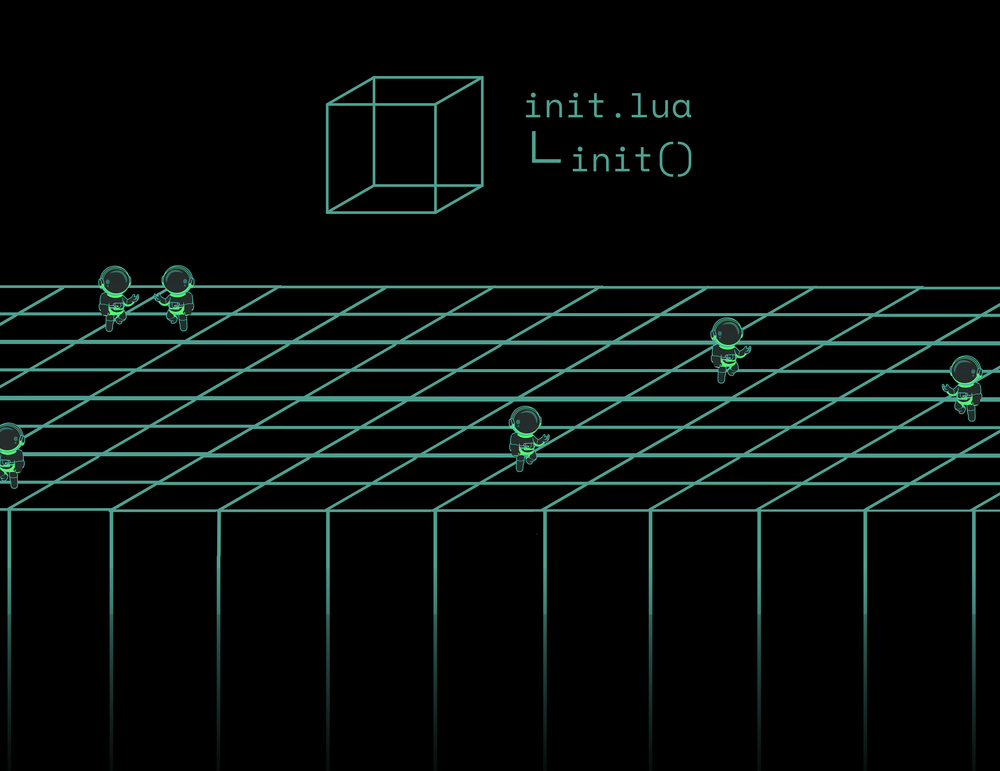
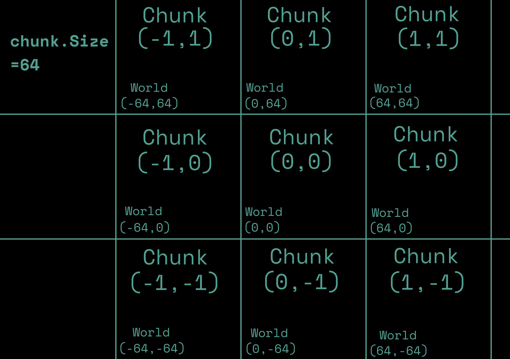

# Chunks

Planetary Processing works by dividing your world into chunks. Chunks are cuboid segments of the world of fixed width and depth, and of infinite height.

<figure><figcaption></figcaption></figure>

## Chunk Creation

Every game world requires a file called `init.lua` in the root of your game's [git](git.md) repository. This file contains your chunk code.&#x20;

### Init

The `init.lua` file only has one function called [`init`](chunks.md#init-1) which is called whenever this chunk is loaded and is designed to initiate the state of this chunk.

```lua
function init()
end
```


## Chunk Size and Coordinates

Every chunk has an [X](chunks.md#chunk) and [Y](chunks.md#chunk) value, based on its position in the world. The exact boundaries of the chunk are defined by the [Chunk Size](chunks.md#chunk). Multiplying each chunk coordinate value by the [Chunk Size](chunks.md#chunk) will give a point position at the bottom left corner of that chunk, in terms of the game's world coordinates.

<figure><figcaption></figcaption></figure>

## World Generation

The [`init`](chunks.md#init-1) function triggers every time a chunk loads or reloads. This will happen whenever a player or [Chunkloader](entities.md#entity) entity comes near it. This means the [`init`](chunks.md#init-1) code will often be triggered multiple times, over the course of a game world's lifetime.

The [Generated](chunks.md#chunk) field of a chunk allows you to distinguish whether it is loading for the first time, or has been generated before and is reloading. This is useful if you want to spawn or setup your world in a specific way when it is first generated.

```lua
-- init is called every time a chunk is loaded
function init()
  -- create a cat entity at coordinates (-35,25,1),
  -- whenever a chunk is loaded or reloaded
  local cat = api.entity.Create("cat", -35, 25, 1, {name="jar jar "})
  -- the Transient property removes an entity whenever its chunk is unloaded
  -- this helps to curb the overall number of existing entities
  cat.Transient = true

  -- if the chunk has never been loaded, then chunk.Generated will be false
  if not chunk.Generated then
    -- create some tree entities at random locations in each chunk, 
    -- but only the first time that chunk is loaded
    for i=1,math.random(4) do
      api.entity.Create("tree", 
                        chunk.X * chunk.Size + math.random() * chunk.Size, 
                        chunk.Y * chunk.Size + math.random() * chunk.Size, 
                        1, 
                        {})
    end
  end
end
```


## Chunk API

Information about the current chunk can be accessed from the global variable [`chunk`](chunks.md#chunk). Entities within the chunk and the chunk itself both have access to this information.

### Chunk

| Field     | Type   | Description                                                                                                                       |
| --------- | ------ | --------------------------------------------------------------------------------------------------------------------------------- |
| X         | int    | X coordinate in chunk space.                                                                                                      |
| Y         | int    | Y coordinate in chunk space.                                                                                                      |
| Size      | int    | Size of the chunk in world units.                                                                                                 |
| Generated | bool   | Indicates whether or not this chunk has been loaded before. This should not be used outside of the `init` function.               |
| Dimension | string | ID of the current dimension.                                                                                                      |
| Data      | table  | Custom lua table which can be used to store arbitrary data about the chunk, such as heightmap or other terrain info, for example. |


***

### Init


| Method | Parameters | Return Value | Description                                              |
| ------ | ---------- | ------------ | -------------------------------------------------------- |
| Init   | None       | None         | A necessary function, which runs whenever a chunk loads. |

