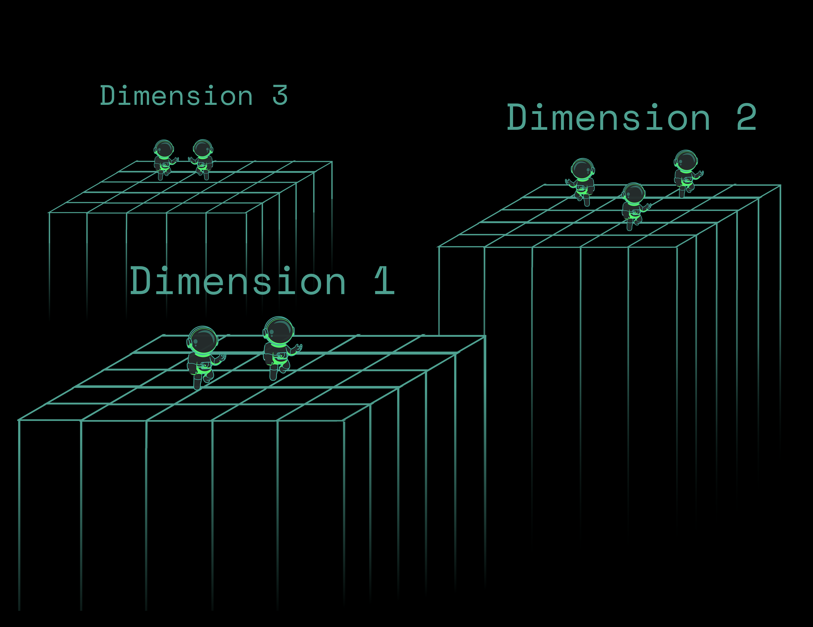

# Dimensions

Planetary Processing games can have multiple separate dimensions simulated in parallel, with entities transitioning between these seemlessly. This is useful for several use cases, for example:

* Creating separate parallel, persistent, dimensions akin to the Nether or End in Minecraft.
* Creating separate dimensions for matches, lobbies, dungeons or private sessions.
* Creating pocket dimensions, for example, a player's house or a dungeon.

By default, there is only one dimension. Its ID is an empty string (`""`). New dimensions can be created and destroyed with API calls.


## Creating and Deleting a Dimension

Creating a new dimension is simple. Use the [`Create`](dimensions.md#dimensions-api) function:

```lua
api.dimension.Create(dimension)
```

When a dimension is first loaded, a small number of chunks around the origin will be [loaded](chunks.md#world-generation). This process is the same as the default dimension, when a game is started. If a dimension with the same [dimension](dimensions.md#dimension-api) ID already exists, no new dimension will be created.

Similarly, to delete a dimension one calls the [`Delete`](dimensions.md#dimension-api) function:

```lua
api.dimension.Delete(dimension)
```

Note that when a dimension is deleted, it might not be unloaded immediately. If a player is still in that dimension it will wait for the player to leave first, but will not load any new chunks.

<figure><figcaption></figcaption></figure>

## Sending an Entity Between Dimensions

When an entity is created, it is created in the same dimension as whatever called the [Create](entities.md#entity-api) function. To send an entity between two dimensions you call the `Warp(dimension, x, y, z)` function on the entity object.&#x20;

The [Warp](entities.md#methods) function's coordinate fields are optional and default to (0,0,0) if not specified. Specifying just two coordinates will also work, for example, if your game is 2D or otherwise where 0 is the desired z-axis value. See below for an example:

```lua
-- entity_type_name.lua

-- called when this entity receives a message
local function message(self, msg)
  self:Warp("test")
end
```

In the above example, when this entity receives a message it will transport itself to the dimension with the ID `test`. If this dimension doesn't exist, this API call will fail and a message will be printed to the console.&#x20;

Additionally, an entity will only transition to a dimension, if the required chunk is loaded. Otherwise it will wait for it to be loaded. This works in the same way that entities will wait if they attempt to move into an unloaded chunk in the same dimension. Players and [Chunkloader](entities.md#fields) entities are not required to wait and will automatically load the required chunk.


## Generating a Dimension

The [`init`](chunks.md#init-1) function is called as normal for chunks in all dimensions. If you wish to vary generation by dimension, then you can access the dimension ID of the current dimension in the [`chunk.Dimension`](chunks.md#chunk) field.


## Viewing a Dimension

On the control panel, within the game overview page you can see a dropdown at the top left of the map which allows you to select which dimension you are monitoring.


## Dimension API

The full dimensions API is shown below, these functions are accessed by interfacing with the `api.dimension` object in the global scope within all server-side scripts.


