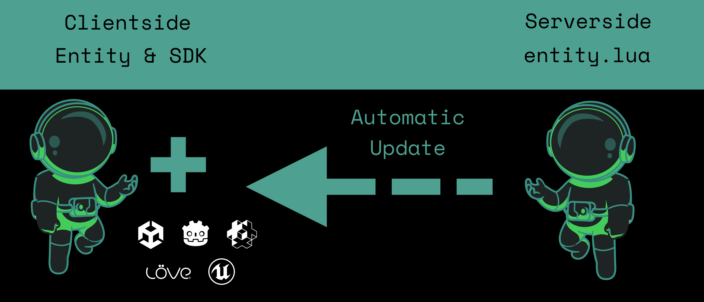
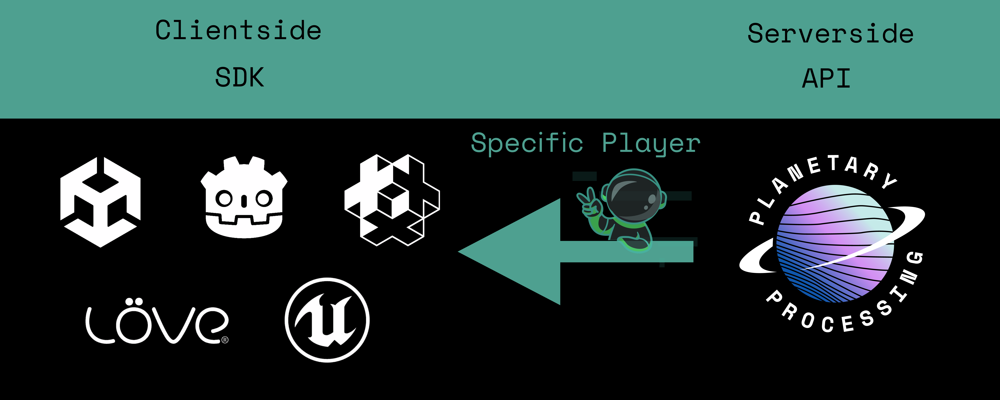
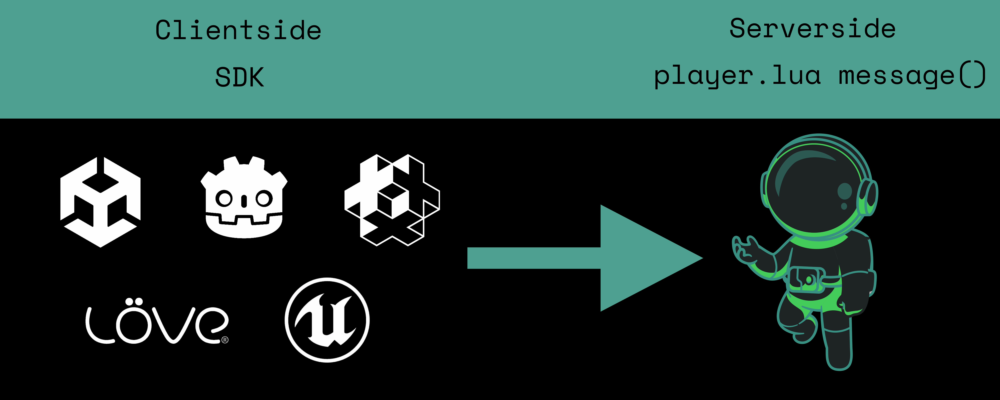
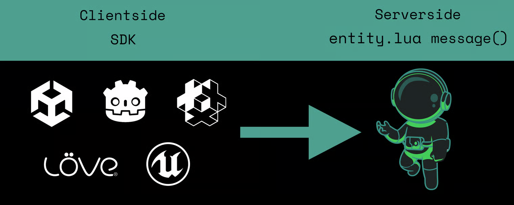

# Entities

Your game is made up of entities each of which have an associated [UUID](entities.md#entity), [position](entities.md#entity), [type](entities.md#types-and-behaviour-scripting) and [data](entities.md#entity). These fields can be edited and used alongside [Entity Functions](entities.md#methods) to create gameplay.

<figure><figcaption></figcaption></figure>

## Types & Behaviour Scripting

[Entities](entities.md#entity) are divided into types, each of which have their own behaviour. This behaviour is determined by a script in the `entity` folder. To create a new entity type, simply create a new file in this folder, call the file `entity_type_name.lua` and add the stub code shown below:

```lua
-- entity_type_name.lua file
local function init(self)
end

local function update(self, dt)
end

local function message(self, msg)
end

return {init=init,update=update, message=message}
```

There must always be an [Entity Type](entities.md#entity) called `player` which acts as the abstraction for both the player client and other players within the simulation.

These three functions [init()](entities.md#init), [update()](entities.md#update), and [message()](entities.md#message) govern the behaviour of all entities of this type. Each must be referenced and returned in a table at the end of the file.


### Init

The [init()](entities.md#init-1) function is called when the entity is created and should be used to set initial state (for example, setting the [Chunkloader](entities.md#entity) or [Data](entities.md#entity) fields).

```lua
local function init(self)
end
```

### Update

The [update()](entities.md#update-1) function is called each tick to update the [entity](entities.md#entity), for movement and repeating processes. The parameter [`dt`](entities.md#update-1) is the time since the last [update](entities.md#update-1) in seconds.

```lua
local function update(self, dt)
end
```

### Message

The [message()](entities.md#message-1) function **receives** messages sent to this entity and [processes](entities.md#entity-messaging) them. Messages can come from [other entities](entities.md#entity-messaging) or the game client.

All messages sent from the game client are sent to the `player` entity, and received by the [message()](entities.md#message-1) function in `player.lua`. If a message is sent from the client, its message's [`Client`](entities.md#message-1) field will be true.

```lua
local function message(self, msg)
end
```

The `msg` argument supplied to this function is defined as follows:

| Field  | Type  | Description                                                                                                             |
| ------ | ----- | ----------------------------------------------------------------------------------------------------------------------- |
| Data   | table | Contains the content of the message.                                                                                    |
| Client | bool  | <p>True, if the message was sent from a game client.</p><p></p><p>False, if sent from another entity on the server.</p> |


## Entity Messaging

Messages between entities are sent using [`api.entity.Message()`](entities.md#entity-api). They are received by an entity's [`message`](entities.md#message) function.

For example, sending a message to a particular entity each tick would look like:

```lua
local function update(self, dt)
  api.entity.Message(receiverid, {message="hello there", from=self.ID})
end
```

And be received like this:

```lua
local function message(self, msg)
  print("The id of the sender is: ", msg.Data.from) -- prints self.ID
  print("The message is: ", msg.Data.message) -- print "hello there"
end
```


## Client Messaging

Unlike serverside entity messaging, the exact code for messaging between the client and the server can vary depending on the game engine. However the base systems for messaging are the same.&#x20;

There are four types of messaging:&#x20;

* [Server-To-Client Updates](entities.md#server-to-client-updates)
* [Server-To-Client Messages](entities.md#server-to-client-messages)
* [Client-To-Server Messages](entities.md#client-to-server-messages)
* [Direct Entity Messaging](entities.md#direct-entity-messaging)

### Server-To-Client Updates

Update messages are sent to the client automatically. They send entity [Data](entities.md#entity) to all connected clients, every tick. This is the main way entities in your game engine know how to move and act.

These updates are sent to the entity itself and, depending on the engine, to whichever script is maintaining the connection to the server.

<figure><figcaption><p>Automatic Server to Client Updates</p></figcaption></figure>

### Server-To-Client Messages

Messages can be sent from the server to the client manually too. Unlike updates, these are sent to the game client of a specific player, using [`api.client.Message()`](../api-reference/client-api/message.md). Server-to-client messages are received by the [SDK's](broken-reference) designated server-to-client messaging function.

<figure><figcaption><p>Manual Server to Client Messages</p></figcaption></figure>

### Client-To-Server Messages

Messages from the game client to the game server must be sent manually, using a message function in the relevant [SDK](broken-reference). This is the main way of sending the gamer's movement inputs and actions to the server.&#x20;

By default the player entity on the server will receive all client messages. The [`message`](entities.md#message-1) function of the `player.lua` file handles these messages.

<figure><figcaption><p>Client to Server Messaging</p></figcaption></figure>

### Direct Entity Messaging

Messages can be sent the game client to a specific entity on the server using the direct message  function in the [SDK](broken-reference). <mark style="color:yellow;">(Direct Messaging is in Beta and not available for</mark> [<mark style="color:yellow;">all SDKs</mark>](../sdks/feature-comparison.md)<mark style="color:yellow;">)</mark>.

<figure><figcaption><p>Direct Entity Messaging</p></figcaption></figure>


## Entities and Chunks

Entities won't load game world [chunks](chunks.md), by default. If an entity tries to move into an unloaded chunk, it will delay processing until the chunk is [loaded](chunks.md#world-generation). Players and [Chunkloader](entities.md#entity) entities are not required to wait and will automatically load the required chunk.&#x20;

Entities can access the data for the chunk they are in, using the [`chunk`](chunks.md#chunk-api) variable.&#x20;


## Example Cat Entity

Below is the example `cat.lua` script which exists in the default template repository. The comments provide further information on what each line is doing.

```lua
-- cat.lua
-- init called on creation of entity
local function init(self)
    -- set self.Chunkloader = true means this entity's chunk will always remain loaded
    self.Chunkloader = true
    -- self.Data is an arbitrary table, this is persisted, populated here with target coordinates
    self.Data.target = { x = math.random(-64, 64), y = math.random(-64, 64) }
end

-- update called each simulation step, with dt being the number of seconds since last step (float)
local function update(self, dt)
    -- position must be fetched using self:GetPosition method
    x, y, _ = self:GetPosition()
    -- calculate distance from target on x and y axis
    local dx = self.Data.target.x - x
    local dy = self.Data.target.y - y
    -- if we're close enough then consider ourselves successful
    if dx * dx < 4 and dy * dy < 4 then
        self.Data.target = { x = math.random(-chunk.Size+1, chunk.Size*2-1), y = math.random(-chunk.Size, chunk.Size*2-1) }
    else
        -- determine largest direction of motion
        if dx * dx > dy * dy then
            dx = dx < 0 and -1 or 1
            dy = 0
        elseif dy * dy > dx * dx then
            dy = dy < 0 and -1 or 1
            dx = 0
        else
            dx = dx < 0 and -1 or 1
            dy = dy < 0 and -1 or 1
        end
        -- self:Move(dx, dy, dz) moves relative to current position
        -- by multiplying by dt we move at a constant speed regardless of performance
        -- we also have self:MoveTo(x, y, z) which moves to an absolute position
        -- note that z is left as 0 as this is a 2D game
        self:Move(dx * dt, dy * dt, 0)
    end
end

-- called when this entity receives a message
local function message(self, msg)
end

-- entity file must return table of this format
return { init = init, update = update, message = message }

```


## Entity API

A number of API calls are available for certain entity-related actions such as spawning entities, they are accessed by interfacing with the `api.entity` object in the global scope within all server-side scripts.




***

### Entity

#### Fields



#### Methods

Each of these methods takes the entity object `self` as its first parameter. Hence you may use `self:Move(dx, dy, dz)` instead of `self.Move(self, dx, dy, dz)`.




***

### Init




***

### Update




***

### Message



