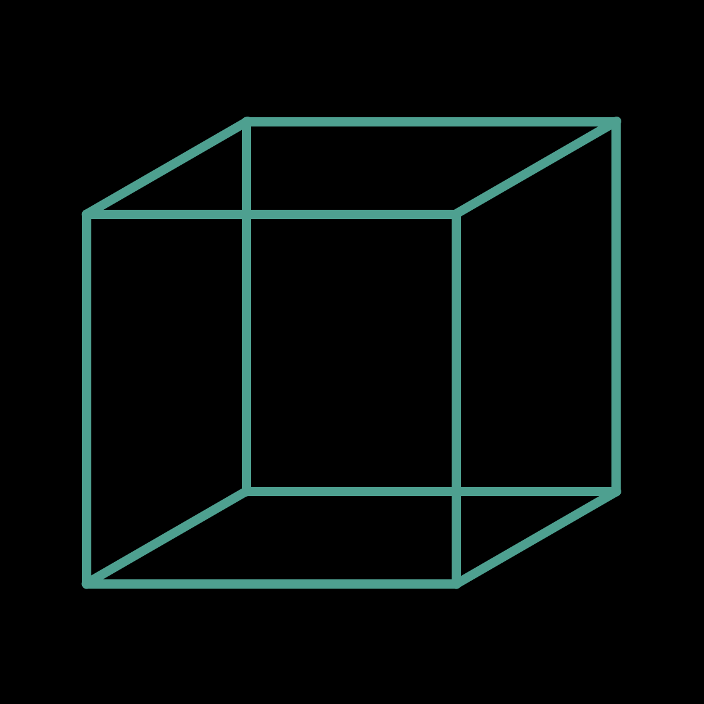
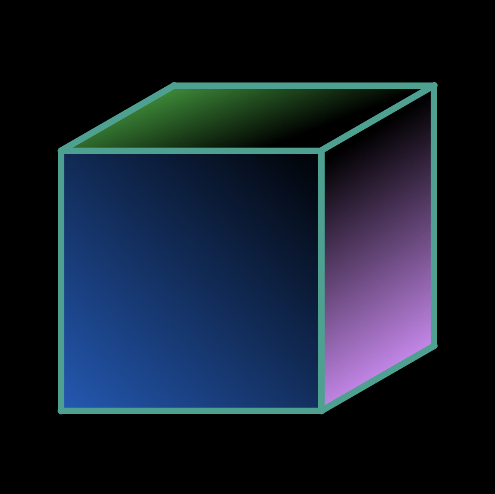
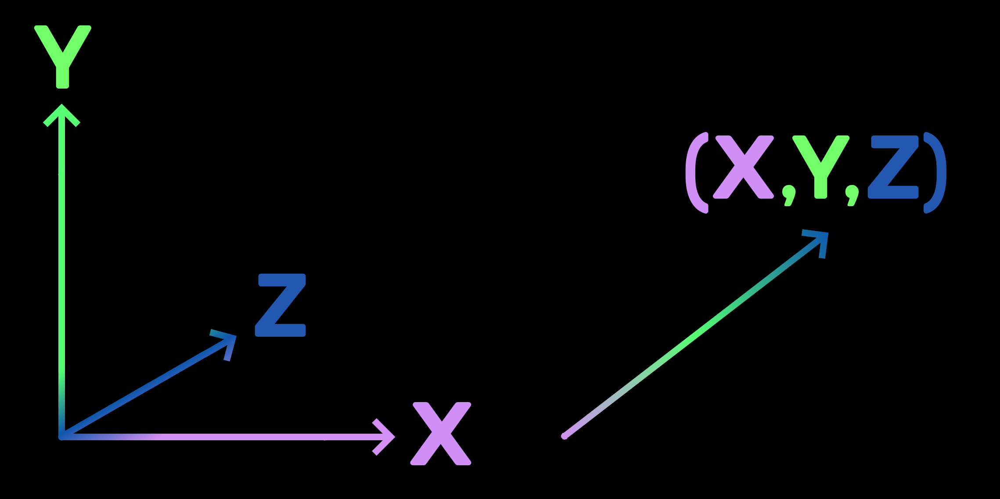
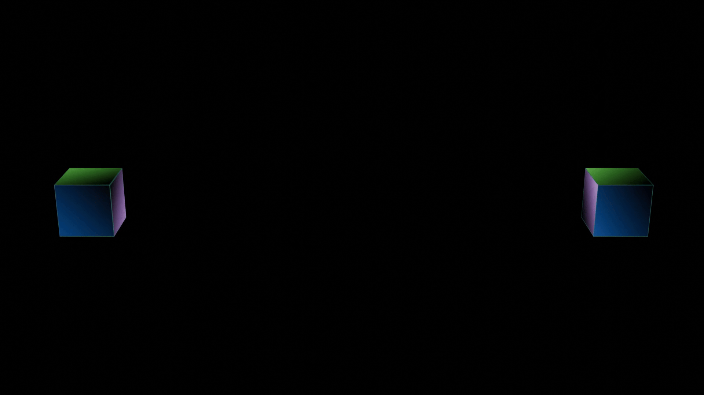
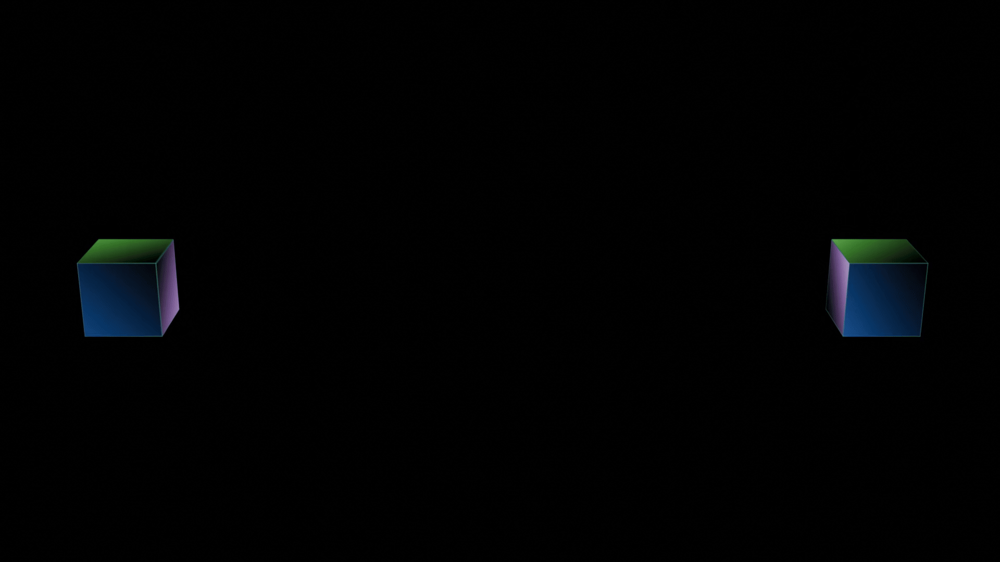

# Physics

_<mark style="color:yellow;">**\[This feature is still in Open Beta and may have some bugs.**</mark>_ \
_<mark style="color:yellow;">**Please direct any feedback to the Planetary Processing Team on**</mark>_ [_<mark style="color:yellow;">**Discord**</mark>_](https://pp.vg/discord)_<mark style="color:yellow;">**]**</mark>_

Physics is an optional server-side setting that can be enabled for entities. When physics is applied to an entity, it is assigned a mass, a body (defining its shape), and a velocity. Forces can be applied to modify an entity’s velocity, and collisions between entities are simulated server-side.

## Using Physics

Physics must be enabled on an entity for it to have a [velocity](physics.md#body-1) and interact in [collisions](physics.md#collisions). An entity with physics enabled will not collide with another entity that does not have Physics enabled.

1. #### Enable Physics:

```lua
self.Physics = true
```

2. #### Assign a [Body](physics.md#body-1) & [Mass](physics.md#body-1):

The body can be either a sphere or a box.&#x20;

```lua
local box = api.physics.NewBoxShape(1, 1, 1) -- width=1, length=1, depth=1
self.Body = api.physics.NewBody(box, 10) --shape=box, mass=10
```

3. #### Set [Velocity ](physics.md#body-1)or apply [Forces](physics.md#force):

```lua
--1: Set velocity
self.Body.Velocity = api.physics.NewVector(0, -20, 0)
--2: Apply a one-time force 
local vector = api.physics.NewVector(0, .2, 0)
self.Body:ApplyForce(vector)
```

#### Force

The function [ApplyForce()](physics.md#body-1) applies a force to an entity once during a physics update and is then reset immediately afterward. To apply a continuous [force](physics.md#body-1), you must reapply it each update.

Multiple [forces](physics.md#body-1) can be applied within a single update cycle. These [forces](physics.md#body-1) are combined and applied together in the next physics update.

```lua
self.Body:ApplyForce(vector)
```


## Physics Objects

### Shape

The Planetary Processing physics engine currently supports two kinds of 3D [shapes](physics.md#shape-1): a box or a sphere. [Shapes](physics.md#shape-1) are used to define the [collision](physics.md#collisions) boundaries for an entity's [Body](physics.md#body).

<figure><figcaption></figcaption></figure>

### Body

The [Body](physics.md#body-1) represents an entity for the game's server-side physics. It defines the entity’s [shape](physics.md#shape-1) and mass. These attributes determine how the entity interacts with [forces](physics.md#force), [collisions](physics.md#collisions), and other physics-based calculations.

<figure><figcaption></figcaption></figure>

### Vector

For physics interactions in 3D space, motion occurs across the X, Y, and Z axes. So it helps to group XYZ values into [vectors](physics.md#vector-1) to represent a single direction, for fields like velocities and [forces](physics.md#force).

<figure><figcaption></figcaption></figure>

## Collisions

When two entities with [Physics](physics.md#using-physics) enabled and a [Body](physics.md#body-1) intersect, they collide. The physics engine calculates a **3D elastic collision**, determining the resulting motion [vectors](physics.md#vector-1).

* **Collisions are Elastic:** No energy is lost during collisions.
* **Collision Detection:** Collisions are only detected if entities are overlapping during an update.

<figure><figcaption><p>Elastic Collision</p></figcaption></figure>

### Fixed Body Collisions

To simulate a fixed body, such as a wall, assign it a very high [mass](physics.md#body-1) (e.g., 999999). The [mass](physics.md#body-1) should be several orders of magnitude larger than other entities that might collide with it. This ensures the [body’s velocity](physics.md#body-1) remains effectively unchanged during collisions, with all energy transferred to the colliding object.&#x20;

For absolute certainty that it won’t move, manually set its [velocity](physics.md#body-1) to 0 every update.

<figure><figcaption><p>Collision between two box-shaped bodies of the same size/shape. <br>One depicted with a very high mass. </p></figcaption></figure>

### Inelastic Collisions

To create an inelastic collision (in which rebound momentum is not conserved), try applying an additional [force ](physics.md#body-1)to an object when its [velocity](physics.md#body-1) changes.

<figure><figcaption><p>Inelastic collision</p></figcaption></figure>

<figure><figcaption><p>Inelastic collision between a faster and slower cube.</p></figcaption></figure>

### **Troubleshooting Collisions**

If the game's **ticks per second (TPS)** is low and an entity's speed is high, collisions may be missed. To prevent this, ensure:

$$
\frac{Entity Max Speed }{Entity Min Diameter} > TPS
$$

A higher TPS reduces the risk of undetected collisions and unintended behaviour.

<figure><figcaption><p>Collision fails because of a very low TPS.</p></figcaption></figure>

## Physics API

A number of API calls are available for certain physics-related actions, such as creating a physics Body. They are accessed using the `api.physics` object available to all server-side scripts.

Methods




***

### Shape

```lua
api.physics.NewBoxShape(1, 1, 1)
api.physics.NewSphereShape(1)
```




***

### Body

```lua
api.physics.NewBody(shape, mass)
```

#### Fields



#### Methods

Each of these methods takes the Body object `self.Body` as its first parameter. Hence you may use `self.Body:ApplyForce(force)` instead of `self.Body.ApplyForce(self.Body, force)`.




***

### Vector

```lua
api.physics.NewVector(1,1,0)
```

#### Fields



#### Methods

Each of these methods takes the `Vector` object as its first parameter. Hence you may use `vector_a:Add(vector_b)` instead of `vector_a.Add(vector_a,vector_b)`.

```lua
v1 = api.physics.NewVector(1,1,0)
v2 = api.physics.NewVector(0,2,2)

sum_v1_v2 = v1:Add(v2)
-- sum_v1_2 is now &{1 3 2}
```




## Notes

* Currently rotation is not supported.
* Planetary Processing Physics is in continuous development. Please contact us on our [Discord](https://pp.vg/discord) if you would like to request specific functionality.
* Due to synchronization between multiplayer elements, physics is **not deterministic**. This means that you may experience different physics interactions each time you run a simulation.&#x20;
