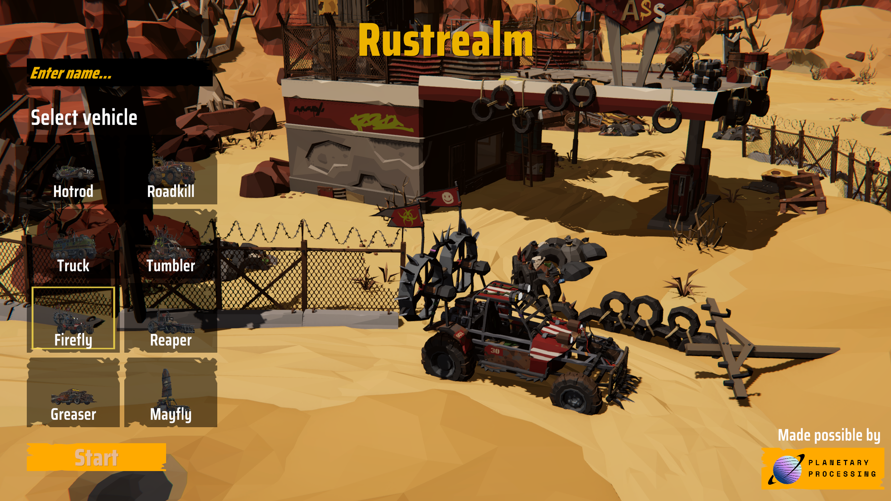

# Rust Realm (MMO by BiteMe Games)

**Rust Realm** is an open-world MMO driving game developed by **BiteMe Games** in under a week. Built as a technical showcase, it demonstrates the power and flexibility of Planetary Processing for real-time multiplayer games at scale.

<figure><figcaption></figcaption></figure>

### **Gameplay Overview**

In _Rust Realm_, players can choose a vehicle and traverse an open world, delivering items from zone to zone. The objective is simple: transport cargo while navigating dynamic terrain and outmanoeuvring other players.

To aid in your deliveries, the game features several item pickups:

* **Speed Boosts** – Gain a temporary surge in speed.
* **Health Kits** – Restore your vehicle's health.
* **Bombs** – Deployable offensive tools to disrupt other players.

There is no login required to join, and there is **no player cap**—any number of players can join and interact in the world at once.

### Demo and Resources

* **Gameplay Demo:** [Watch on YouTube](https://youtu.be/jFi9lrMgQbM?si=ddbUCG7fN2-UHzGu)
* **Template:** [Source Code & Playable Build](https://drive.google.com/drive/folders/1-Z0qODkEr2sE0C8KsHsh9dGRfLN-92Dp?usp=drive_link)
* **Server Code:** [Github](https://github.com/PlanProcCommMan/rust-realm-template)
* **Game ID:** 7931

### Key Files and Concepts

To explore the project structure and understand how different systems are implemented, consider the following files and assets:

* **`Assets/Scenes/Game.unity`** – Main game scene.
* **`Server` GameObject** – The master object responsible for connecting to the Planetary Processing backend.
* **`Assets/Resources/Vehicles/Firefly.prefab`** – A player vehicle prefab.
* **`Assets/Prefabs/ItemBox.prefab`** – Example of a non-player entity (item spawner).
* **`Assets/Scripts/CarController.cs`** – Handles sending player position and input data to the server.
* **`Assets/Scripts/NetworkPlayer.cs`** – Responsible for receiving and applying server updates for other players.

### Try It Yourself

Here are a few suggestions for experimenting with or extending the Rust Realm codebase:

* **Modify bomb behaviour** – Adjust the lifetime or damage value of the bomb item in the backend logic.
* **Tweak item spawn logic** – Change item spawn rate and respawn time by editing the relevant logic in init.lua and itemBox.lua.
* **Add AI-controlled vehicles** – Create simple bots that roam the map, potentially using Unity’s NavMesh or basic movement scripts.

### Running Your Own Copy

To clone and run your own version of Rust Realm:

1.  **Clone the template backend code from Github:**

    ```
    git clone https://github.com/PlanProcCommMan/rust-realm-template
    ```
2. Start a new Planetary Processing game project and [clone](../server/git.md) its repository.
3. **Copy the Rust Realm files into your new game repository.** Then add, commit and push it to your planetary processing repository:
4. **Go to the Planetary Processing panel** and click **Refresh**. You should now see the Rust Realm backend files listed under your new game.
5.  **Update the Game ID in Unity:**

    In the Unity editor:

    * Select the 'Server' GameObject at the top level of the hierarchy.
    * Update the **Game ID** field in the Inspector to match your new game's ID.

Once this is done, you’ll be able to run your own instance of Rust Realm, complete with your own modifications and backend logic.
